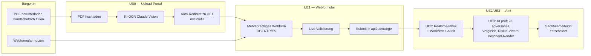

# Digitalisierung in der Verwaltung — Fallstudie APL 2

> Innovationsmanagement-Modul, Dr. Robert Butscher · THWS · 4 Unterrichtseinheiten am gleichen Fall:
> **Antrag „Altentagesstätten — Betriebs- und Personalkostenzuschüsse" der Stadt Würzburg (APL 2)**, modelliert über vier aufeinander aufbauende Reifegradstufen UE0 → UE3.

## Worum es geht

Studierende erleben am identischen Verwaltungsfall, wie sich die heutige PDF-Mail-Welt in eine moderne, ki-gestützte Sachbearbeitungs-Architektur überführen lässt — Schritt für Schritt, mit jeweils klaren Vorteilen, Voraussetzungen und Grenzen pro Stufe.

| | Stufe | Was neu ist | Stack | Studi-Rolle |
|---|---|---|---|---|
| **UE0** | OCR-Upload-Portal | Bürger lädt das gewohnte PDF hoch, KI extrahiert Felder, leitet automatisch zu UE1 weiter | Vite/TS + Supabase Edge Function + n8n + Claude Vision | Demo |
| **UE1** | Mehrsprachiges Webformular | Online-Antrag in DE/IT/TR/ES mit Live-Validierung, Anlagen-Upload, atomare DB-Persistenz | Vite/TS + Supabase | Demo + Mini-Hands-on |
| **UE2** | Sachbearbeiter-Cockpit | Realtime-Inbox, Workflow-Engine, Audit-Trail, automatische 4-sprachige Eingangsbestätigung | React 19 + Tailwind 4 + Supabase Auth + n8n | Demo + Mini-Hands-on |
| **UE3** | KI-Sachbearbeitung | Erst-KI + adversarieller Zweit-Prüfer, Vorjahresvergleich, Risiko-Score, externe Validierung, Bescheid-Render, Compliance-Cockpit (AI Act) | FastAPI + Anthropic + Voyage + Perplexity + LM Studio | Hands-on |

## Doku pro Stufe

Jede UE hat **drei Dateien**: ein Konzept-Kapitel (warum gibt es diese Stufe, was ändert sich), ein Vorteile-/Voraussetzungen-Kapitel (technisch, organisatorisch, rechtlich) und einen Code-Walkthrough mit Mitmach-Aufgaben.

- **UE0** — OCR-Upload-Portal · [Konzept](ue0/upload-portal/01-konzept.md) · [Vorteile & Voraussetzungen](ue0/upload-portal/02-vorteile-voraussetzungen.md) · [Walkthrough](ue0/upload-portal/03-walkthrough.md) · [README](ue0/upload-portal/README.md)
- **UE1** — Webformular · [Konzept](ue1/webformular/01-konzept.md) · [Vorteile & Voraussetzungen](ue1/webformular/02-vorteile-voraussetzungen.md) · [Walkthrough](ue1/webformular/03-walkthrough.md) · [README](ue1/webformular/README.md)
- **UE2** — Sachbearbeiter-Cockpit · [Konzept](ue2/sachbearbeiter/01-konzept.md) · [Vorteile & Voraussetzungen](ue2/sachbearbeiter/02-vorteile-voraussetzungen.md) · [Walkthrough](ue2/sachbearbeiter/03-walkthrough.md) · [README](ue2/sachbearbeiter/README.md)
- **UE3** — KI-Sachbearbeitung · [Konzept](ue3/sachbearbeitung-ki/01-konzept.md) · [Vorteile & Voraussetzungen](ue3/sachbearbeitung-ki/02-vorteile-voraussetzungen.md) · [Walkthrough](ue3/sachbearbeitung-ki/03-walkthrough.md) · [README](ue3/sachbearbeitung-ki/README.md)

## Live-Demos

| Stufe | URL |
|---|---|
| Landing-Page mit allen Stufen | https://swrobuts.github.io/DigitalisierungVerwaltung/ |
| UE0 — Upload-Portal | https://swrobuts.github.io/DigitalisierungVerwaltung/ue0/upload-portal/ |
| UE1 — Webformular | https://swrobuts.github.io/DigitalisierungVerwaltung/ue1/webformular/ |
| UE2 — Sachbearbeiter-Cockpit (Login erforderlich) | https://amt.butscher.cloud |
| UE3 — KI-Sachbearbeitung (Login erforderlich) | https://ki.butscher.cloud |
| Backend API (FastAPI, OpenAPI-Doku) | https://pruefung.butscher.cloud/docs |

Login für UE2/UE3 nur mit Allowlist-Mailadresse (`apl2.allow_email`).

## Roter Faden: Vier Reifegrade, ein Antrag



## Architektur und Infrastruktur

- **Self-hosted Supabase** auf `supabase.butscher.cloud` (Postgres mit Schema `apl2`, Auth via GoTrue, Storage, Edge Functions in Deno, Realtime)
- **n8n** auf `n8n.butscher.cloud` für ereignisgetriebene Workflows (PDF-OCR-Pipeline, Eingangsbestätigung)
- **Anthropic Claude Sonnet 4.5 / Opus** für OCR (UE0) und KI-Prüfung (UE3); optional **LM Studio** als lokaler Datenschutz-Provider
- **Voyage 3** für Norm-Embeddings (UE3 Doctree-Navigation)
- **Perplexity** für externe Träger-Recherche (UE3)
- **Frontend-Hosting**: GH Pages für UE0/UE1 (statisch), Docker + Traefik + Let's Encrypt für UE2/UE3
- **Backend-Hosting**: FastAPI/Uvicorn-Container + Traefik für UE3 (`pruefung.butscher.cloud`)

Alle API-Keys sind ausschließlich als Container-Env-Variablen gesetzt — niemals im Repo, niemals im Frontend-Bundle, niemals im n8n-Workflow hardcoded.

## Verzeichnisstruktur

```
DigitalisierungVerwaltung/
├── ue0/upload-portal/         Vite-TS-Frontend UE0
├── ue0/demo-pdfs/             generierte ausgefüllte Demo-PDFs + Generator
├── ue1/webformular/           Vite-TS-Frontend UE1
├── ue2/sachbearbeiter/        React-Cockpit UE2
├── ue3/sachbearbeitung-ki/    React-Cockpit UE3
├── pruefung/                  FastAPI-Backend UE3
├── supabase/
│   ├── migrations/            DDL pro UE inkrementell (047 = UE0, 007–014 = UE2, 029–049 = UE3 Doctree)
│   ├── functions/             Deno-Edge-Functions (submit-antrag, upload-antragspdf)
│   └── webhooks/              n8n-Workflow-Exports (importierbar via UI)
├── docs/superpowers/
│   ├── specs/                 Design-Docs pro UE
│   └── plans/                 Implementations-Pläne
├── materialien/               Original-PDFs + Förderrichtlinie
└── Fake_Belege/               seed.sql + Demo-Belege (synchron mit ue0/demo-pdfs)
```

## Rechtlicher Hinweis

Diese Repository ist **kein offizielles Angebot der Stadt Würzburg**, sondern eine Lehr-Fallstudie:

- Kein offizielles Stadt-Würzburg-Logo, sondern ein gemeinfreies historisches Stadtwappen
- Eigene Domains (`*.butscher.cloud` + GH Pages), nicht `wuerzburg.de`
- Disclaimer in jedem Frontend macht den Demo-Charakter explizit
- Bei Demo-Eingaben gilt: hochgeladene Dokumente und gespeicherte Antragsdaten werden nach Vorlesungsende gelöscht

Die Förderrichtlinie ist die echte AHP-Richtlinie 2025-03-27 der Stadt Würzburg — sie ist öffentlich zugänglich und in `materialien/foerderrichtlinie-ahp-2025-03-27.pdf` archiviert.
