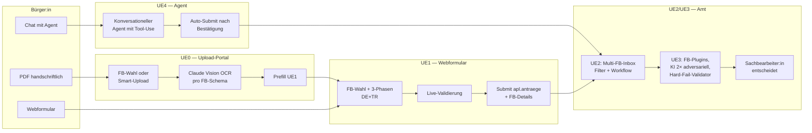

# Digitalisierung in der Verwaltung — Fallstudie AHP Würzburg

> Innovationsmanagement-Modul, Dr. Robert Butscher · THWS · 5 Unterrichtseinheiten am gleichen Fall:
> **Altenhilfe-Förderrichtlinie (AHP) der Stadt Würzburg mit 4 Förderbereichen (I–IV)**, modelliert über fünf aufeinander aufbauende Reifegradstufen UE0 → UE4.

## Worum es geht

Studierende erleben am identischen Verwaltungsfall, wie sich die heutige PDF-Mail-Welt schrittweise in eine moderne, ki-gestützte und schließlich agentische Sachbearbeitungs-Architektur überführen lässt — mit jeweils klaren Vorteilen, Voraussetzungen und Grenzen pro Stufe.

| | Stufe | Was neu ist | Stack | Studi-Rolle |
|---|---|---|---|---|
| **UE0** | OCR-Upload-Portal (Multi-FB) | Bürger wählt Förderbereich (I/II/III/IV) oder Smart-Upload klassifiziert PDF automatisch | Vite/TS + Supabase Edge Function + n8n + Claude Vision | Demo |
| **UE1** | Mehrsprachiges Webformular (Multi-FB) | Online-Antrag mit Sprach-Picker DE/TR/IT/RU/FR (DE+TR fertig, andere mit Fallback-Banner), FB-Wahl + 3-Phasen-Flow mit Collapsible-Sections + Live-Validation, Helfer-Inline-Tabelle (FB II), Varianten-Wahl (FB III A/B/C/D), UE0→UE1-Prefill-Brücke nach OCR | Vite/TS/React + Supabase + @dv/data-layer | Demo + Mini-Hands-on |
| **UE2** | Sachbearbeiter-Cockpit (Multi-FB) | Realtime-Inbox mit FB-Filter, FB-spezifischer AntragDetail, Workflow-Engine, manuelle Prüfvermerke, Audit-Trail | React 19 + Tailwind 4 + Supabase Auth + n8n | Demo + Mini-Hands-on |
| **UE3** | KI-Sachbearbeitung (Multi-FB) | FB-Plugin-Architektur, Erst-KI + adversarieller Zweit-Prüfer, Smart-Upload (Klassifizierer + Helferliste-OCR + Excel-Import), Hard-Fail-Quellen-Validator gegen Halluzinationen, Bescheid-Render, Compliance-Cockpit (AI Act) | FastAPI + Anthropic + Voyage + Perplexity + LM Studio | Hands-on |
| **UE4** | Agentisches Antragsformular | Konversationeller Chatbot führt Bürger durch Antrag — Tool-Use für FB-Klassifizierung, Pflichtfeld-Abfrage, Validation, Submit; Halluzinations-Regeln in System-Prompt eingebaut | React + Anthropic Messages API + FastAPI-Tools | Demo |

## Doku pro Stufe

Jede UE hat **drei Dateien**: ein Konzept-Kapitel (warum gibt es diese Stufe, was ändert sich), ein Vorteile-/Voraussetzungen-Kapitel (technisch, organisatorisch, rechtlich) und einen Code-Walkthrough mit Mitmach-Aufgaben.

- **UE0** — OCR-Upload-Portal · [Konzept](ue0/upload-portal/01-konzept.md) · [Vorteile & Voraussetzungen](ue0/upload-portal/02-vorteile-voraussetzungen.md) · [Walkthrough](ue0/upload-portal/03-walkthrough.md) · [README](ue0/upload-portal/README.md)
- **UE1** — Webformular · [Konzept](ue1/webformular/01-konzept.md) · [Vorteile & Voraussetzungen](ue1/webformular/02-vorteile-voraussetzungen.md) · [Walkthrough](ue1/webformular/03-walkthrough.md) · [README](ue1/webformular/README.md)
- **UE2** — Sachbearbeiter-Cockpit · [Konzept](ue2/sachbearbeiter/01-konzept.md) · [Vorteile & Voraussetzungen](ue2/sachbearbeiter/02-vorteile-voraussetzungen.md) · [Walkthrough](ue2/sachbearbeiter/03-walkthrough.md) · [README](ue2/sachbearbeiter/README.md)
- **UE3** — KI-Sachbearbeitung · [Konzept](ue3/sachbearbeitung-ki/01-konzept.md) · [Vorteile & Voraussetzungen](ue3/sachbearbeitung-ki/02-vorteile-voraussetzungen.md) · [Walkthrough](ue3/sachbearbeitung-ki/03-walkthrough.md) · [README](ue3/sachbearbeitung-ki/README.md)
- **UE4** — Agent-Portal · [README](ue4/agent-portal/README.md) *(Konzept-Doku als Followup)*

## Live-Demos

| Stufe | URL |
|---|---|
| Landing-Page mit allen Stufen | https://swrobuts.github.io/DigitalisierungVerwaltung/ |
| UE0 — Upload-Portal | https://upload.butscher.cloud bzw. https://swrobuts.github.io/DigitalisierungVerwaltung/ue0/upload-portal/ |
| UE1 — Webformular | https://antrag.butscher.cloud bzw. https://swrobuts.github.io/DigitalisierungVerwaltung/ue1/webformular/ |
| UE2 — Sachbearbeiter-Cockpit (Login erforderlich) | https://sachbearbeiter.butscher.cloud |
| UE3 — KI-Sachbearbeitung (Login erforderlich) | https://ki.butscher.cloud |
| UE4 — Agent-Portal | https://agent.butscher.cloud |
| Backend API (FastAPI, OpenAPI-Doku) | https://pruefung.butscher.cloud/docs |

Login für UE2/UE3 nur mit Allowlist-Mailadresse (`apl.allow_email`).

## Roter Faden: Fünf Reifegrade, ein Antragsprozess



## Architektur und Infrastruktur

> **📘 Vollständige Architektur-Übersicht:** [`docs/ARCHITECTURE.md`](docs/ARCHITECTURE.md)

- **Self-hosted Supabase** auf `supabase.butscher.cloud` (Postgres mit Schema `apl`, Auth via GoTrue, Storage, Edge Functions in Deno, Realtime)
- **n8n** auf `n8n.butscher.cloud` für ereignisgetriebene Workflows (PDF-OCR-Pipeline, Eingangsbestätigung)
- **Anthropic Claude Sonnet 4.5 / Opus** für OCR (UE0) und KI-Prüfung (UE3); optional **LM Studio** als lokaler Datenschutz-Provider
- **Voyage 3** für Norm-Embeddings (UE3 Doctree-Navigation)
- **Perplexity** für externe Träger-Recherche (UE3)
- **Frontend-Hosting**: GH Pages für UE0/UE1 (statisch), Docker + Traefik + Let's Encrypt für UE2/UE3
- **Backend-Hosting**: FastAPI/Uvicorn-Container + Traefik für UE3 (`pruefung.butscher.cloud`)

Alle API-Keys sind ausschließlich als Container-Env-Variablen gesetzt — niemals im Repo, niemals im Frontend-Bundle, niemals im n8n-Workflow hardcoded.

## Verzeichnisstruktur

```
DigitalisierungVerwaltung/
├── ue0/upload-portal/         Vite-TS-Frontend UE0 (Multi-FB-Wahl + Smart-Upload)
├── ue1/webformular/           Vite-TS-Frontend UE1 (Multi-FB-Wizard)
├── ue2/sachbearbeiter/        React-Cockpit UE2 (Multi-FB-Inbox)
├── ue3/sachbearbeitung-ki/    React-Cockpit UE3 (FB-Plugins + Smart-Upload)
├── ue4/agent-portal/          React-Chatbot UE4 (Agent mit Tool-Use)
├── pruefung/                  FastAPI-Backend (FB-Plugins, Hard-Fail-Validator)
│   └── src/pruefung/foerderbereiche/  1 Plugin pro FB (Subsumtion + Template)
├── packages/                  pnpm-Workspace mit geteiltem Code
│   ├── foerderbereiche/       FB-Konfigs (Pflichtfelder, Anlagen, Validation-Rules)
│   ├── data-layer/            Supabase-Wrapper + db-types für alle UEs
│   └── antrag-renderer/       Schema + read-only AntragViewer (UE2/UE3) — Single Source of Truth
├── supabase/
│   ├── migrations/            DDL inkrementell (060–067 = neue apl-Schema)
│   ├── functions/             Deno-Edge-Functions
│   └── webhooks/              n8n-Workflow-Exports
├── docs/
│   ├── lehrveranstaltung/     Pre-Flight-Checkliste für VL-Demo
│   └── superpowers/           Specs + Plans
├── materialien/wuerzburg-2026/    AHP-Richtlinie + 4 FB-Antrags-PDFs
├── scripts/                   demo-reset.sh, dv-fast-deploy.sh, setup-fast-deploy.sh, gen-schablonen
└── Fake_Belege/               Demo-Belege
```

## Rechtlicher Hinweis

Diese Repository ist **kein offizielles Angebot der Stadt Würzburg**, sondern eine Lehr-Fallstudie:

- Kein offizielles Stadt-Würzburg-Logo, sondern ein gemeinfreies historisches Stadtwappen
- Eigene Domains (`*.butscher.cloud` + GH Pages), nicht `wuerzburg.de`
- Disclaimer in jedem Frontend macht den Demo-Charakter explizit
- Bei Demo-Eingaben gilt: hochgeladene Dokumente und gespeicherte Antragsdaten werden nach Vorlesungsende gelöscht

Die Förderrichtlinie ist die echte AHP-Richtlinie 2025-03-27 der Stadt Würzburg — sie ist öffentlich zugänglich und in `materialien/foerderrichtlinie-ahp-2025-03-27.pdf` archiviert.
