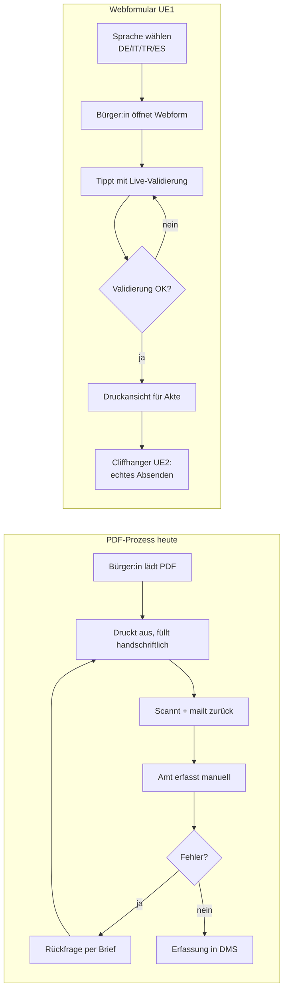

# UE1 Webformular — Implementation Plan

> **For agentic workers:** REQUIRED SUB-SKILL: Use superpowers:subagent-driven-development (recommended) or superpowers:executing-plans to implement this plan task-by-task. Steps use checkbox (`- [ ]`) syntax for tracking.

**Goal:** Ein vollständiges, vorführbares **mehrsprachiges** „intelligentes Webformular" als Ersatz für den PDF-Antrag „APL 2 — Altentagesstätten" der Stadt Würzburg, in UE1 demonstrierbar mit Mini-Hands-on-Slot für Studis und Integrations-Aspekt durch DE/IT/TR/ES-Labels.

**Architecture:** Statisches Vite-Projekt mit Vanilla TypeScript. Domain-Model spiegelt das PDF-Formular 1:1. Validierung als pure Funktionen (Vitest-testbar) getrennt von DOM-Wiring (Browser-manuell-testbar). i18n-Modul mit JSON-basierten Übersetzungen, Sprachauswahl persistiert in localStorage. Submit erzeugt clientseitige Antragsnummer + Bestätigungsseite — bewusst **kein** Backend (das ist UE2-Cliffhanger). Hosting als statische Seite auf GitHub Pages.

**Tech Stack:** Vite 5, TypeScript 5, Vitest, Vanilla DOM, Vanilla CSS, eigenes Mini-i18n (kein i18next-Overhead).

**Annahmen (Plan-Review-revidierbar):**
- A1: Setup-Strategie = lokal + StackBlitz-Fallback (kein Codespaces)
- A2: Vitest als Test-Framework
- A3: Vanilla CSS (kein Tailwind in UE1)
- A4: Mehrsprachigkeit = DE + IT + TR + ES, nur Labels (keine Hilfetexte/Fehlermeldungen), Übersetzungen als „Demo, in Produktion durch Fachübersetzer prüfen" markiert

---

## File Structure

```
DigitalisierungVerwaltung/
├─ .gitignore                              # NEU: node_modules, dist, .DS_Store
├─ materialien/                            # NEU
│  ├─ antrag-apl2.pdf
│  ├─ anlage-antrag-apl2.pdf
│  └─ foerderrichtlinie-ahp-2025-03-27.pdf
├─ folien/                                 # NEU
│  └─ ue1-intro-digitalisierung-verwaltung.pptx
└─ ue1/webformular/
   ├─ package.json
   ├─ tsconfig.json
   ├─ vite.config.ts
   ├─ vitest.config.ts
   ├─ index.html
   ├─ src/
   │  ├─ main.ts                           # Entry-Point: DOM-Wiring + i18n-Init
   │  ├─ types.ts                          # APL2Antrag-Typen + Sprache-Type
   │  ├─ validation.ts                     # Pure Validation-Funktionen
   │  ├─ cross-field.ts                    # Cross-Field-Regeln
   │  ├─ i18n.ts                           # i18n-Modul (setSprache, t, applyTranslations)
   │  ├─ translations.ts                   # Übersetzungs-Tabelle DE/IT/TR/ES
   │  ├─ attachments.ts                    # File-Upload-Logik
   │  ├─ submit.ts                         # Antragsnummer + Bestätigungsseite
   │  ├─ styles.css                        # Layout + Sprachumschalter + Live-Validation-UI
   │  └─ print.css                         # Druck-Stylesheet für Akte
   ├─ tests/
   │  ├─ validation.test.ts
   │  ├─ cross-field.test.ts
   │  └─ i18n.test.ts                      # NEU: i18n-Key-Vollständigkeit + Fallback
   ├─ README.md
   ├─ 01-konzept.md
   ├─ 02-vorteile-voraussetzungen.md
   └─ 03-walkthrough.md
└─ .github/workflows/
   └─ deploy-ue1.yml
```

---

## Task 1: Repo-Hygiene & Materialien-Reorganisation

**Files:**
- Create: `.gitignore`
- Create: `materialien/`, `folien/`
- Move: 3 PDFs nach `materialien/`, PPTX nach `folien/`

- [ ] **Step 1: `.gitignore`**

Datei `/Users/robert/Library/.../DigitalisierungVerwaltung/.gitignore`:
```
node_modules/
dist/
build/
.vite/
.DS_Store
.idea/
.vscode/
*.swp
.env
.env.local
```

- [ ] **Step 2: Ordner + Move**

```bash
REPO="/Users/robert/Library/CloudStorage/OneDrive-Persönlich/Vorlesungen/Übergreifend/Fallstudien/DigitalisierungVerwaltung"
mkdir -p "$REPO/materialien" "$REPO/folien"
mv "$REPO/Antrag APL 2 - Altentagesstätten - Betriebs- und Personalkostenzuschüsse (1).pdf" "$REPO/materialien/antrag-apl2.pdf"
mv "$REPO/Anlage Antrag APL 2 - Altentagesstätten - Betriebs- und Personalkostenzuschüsse.pdf" "$REPO/materialien/anlage-antrag-apl2.pdf"
mv "$REPO/592457_reformierte_foerderrichtlinie_ahp_2025-03-27_final_klein.pdf" "$REPO/materialien/foerderrichtlinie-ahp-2025-03-27.pdf"
mv "$REPO/IntroDigitalisierungVerwaltung.pptx" "$REPO/folien/ue1-intro-digitalisierung-verwaltung.pptx"
```

Expected: `ls $REPO` zeigt nur Ordner und keine losen Dateien.

- [ ] **Step 3: Commit**

```bash
git -C "$REPO" status
git -C "$REPO" add .gitignore materialien/ folien/
git -C "$REPO" commit -m "chore(repo): .gitignore + Materialien/Folien in eigene Ordner"
```

---

## Task 2: Vite+TS+Vitest-Skeleton

**Files:**
- Create: `ue1/webformular/package.json`, `tsconfig.json`, `vite.config.ts`, `vitest.config.ts`, `src/main.ts`, `index.html`

- [ ] **Step 1: Ordner**

```bash
REPO="/Users/robert/Library/CloudStorage/OneDrive-Persönlich/Vorlesungen/Übergreifend/Fallstudien/DigitalisierungVerwaltung"
mkdir -p "$REPO/ue1/webformular/src" "$REPO/ue1/webformular/tests"
```

- [ ] **Step 2: `package.json`**

```json
{
  "name": "ue1-webformular",
  "private": true,
  "version": "0.1.0",
  "type": "module",
  "scripts": {
    "dev": "vite",
    "build": "tsc -b && vite build",
    "preview": "vite preview",
    "test": "vitest run",
    "test:watch": "vitest"
  },
  "devDependencies": {
    "@types/node": "^20.11.0",
    "typescript": "^5.4.0",
    "vite": "^5.2.0",
    "vitest": "^1.5.0"
  }
}
```

- [ ] **Step 3: `tsconfig.json`**

```json
{
  "compilerOptions": {
    "target": "ES2022",
    "module": "ESNext",
    "moduleResolution": "bundler",
    "strict": true,
    "noUncheckedIndexedAccess": true,
    "noImplicitOverride": true,
    "isolatedModules": true,
    "esModuleInterop": true,
    "skipLibCheck": true,
    "lib": ["ES2022", "DOM", "DOM.Iterable"],
    "types": ["vite/client", "vitest/globals"]
  },
  "include": ["src", "tests"]
}
```

- [ ] **Step 4: `vite.config.ts`**

```typescript
import { defineConfig } from "vite";

export default defineConfig({
  base: "/DigitalisierungVerwaltung/ue1/webformular/",
  build: { outDir: "dist", emptyOutDir: true },
});
```

- [ ] **Step 5: `vitest.config.ts`**

```typescript
import { defineConfig } from "vitest/config";

export default defineConfig({
  test: {
    globals: true,
    environment: "node",
    include: ["tests/**/*.test.ts"],
  },
});
```

- [ ] **Step 6: Placeholder `index.html`**

```html
<!doctype html>
<html lang="de">
  <head>
    <meta charset="UTF-8" />
    <meta name="viewport" content="width=device-width, initial-scale=1.0" />
    <title>APL 2 — Antrag Altentagesstätte (Demo)</title>
  </head>
  <body>
    <main id="app"><h1>APL 2 — Antrag (Skeleton)</h1></main>
    <script type="module" src="/src/main.ts"></script>
  </body>
</html>
```

- [ ] **Step 7: Placeholder `src/main.ts`**

```typescript
console.info("UE1 Webformular — Skeleton geladen");
```

- [ ] **Step 8: Install + Dev-Server smoke**

```bash
cd "$REPO/ue1-webformular" && npm install && npm run dev
```
Expected: Vite startet, Seite zeigt „Skeleton", Konsole zeigt „Skeleton geladen". Ctrl-C.

- [ ] **Step 9: Vitest-Smoke**

```bash
cd "$REPO/ue1-webformular" && npx vitest run
```
Expected: „No test files found" (kein Fehler).

- [ ] **Step 10: Commit**

```bash
git -C "$REPO" add ue1/webformular/package.json ue1/webformular/tsconfig.json \
  ue1/webformular/vite.config.ts ue1/webformular/vitest.config.ts \
  ue1/webformular/index.html ue1/webformular/src/main.ts ue1/webformular/package-lock.json
git -C "$REPO" commit -m "feat(ue1): Vite+TS+Vitest-Skeleton für Webformular"
```

---

## Task 3: Domain-Model — `types.ts`

**Files:**
- Create: `ue1/webformular/src/types.ts`

- [ ] **Step 1: Typen**

```typescript
export type JaNein = "ja" | "nein";

export type Sprache = "de" | "it" | "tr" | "es";

export const ALLE_SPRACHEN: Sprache[] = ["de", "it", "tr", "es"];

export interface APL2Antrag {
  haushaltsjahr: number;
  name: string;
  anschrift: string;
  traeger: string;
  bankverbindung: string;
  iban: string;
  bic: string;
  ansprechpartner: string;
  telefon: string;
  email: string;
  betriebskostenVorjahrEuro: number;
  personalkostenVorjahrEuro: number;
  raeumeVorhanden: JaNein;
  raeumeUnentgeltlich: JaNein;
  monatlicheMieteEuro: number;
  antragsdatum: string;          // ISO YYYY-MM-DD
  anlagen: Anlage[];
}

export type AnlagenTyp =
  | "mietvertrag"
  | "programm-altentagesstaette"
  | "anlage-1-kostennachweis"
  | "personalkostenbelege";

export interface Anlage {
  typ: AnlagenTyp;
  dateiname: string;
  groesseBytes: number;
  mimeType: string;
}

export type ValidationErrors = Partial<Record<keyof APL2Antrag | AnlagenTyp, string>>;
```

- [ ] **Step 2: Commit**

```bash
git -C "$REPO" add ue1/webformular/src/types.ts
git -C "$REPO" commit -m "feat(ue1): Domain-Typen (APL2Antrag, Sprache, Anlage)"
```

---

## Task 4: Validation-Utilities mit TDD

**Files:**
- Create: `ue1/webformular/tests/validation.test.ts`, `ue1/webformular/src/validation.ts`

- [ ] **Step 1: Failing Tests für `isValidIBAN`**

Datei `tests/validation.test.ts`:
```typescript
import { describe, expect, it } from "vitest";
import { isValidIBAN } from "../src/validation";

describe("isValidIBAN", () => {
  it("akzeptiert eine gültige DE-IBAN", () => {
    expect(isValidIBAN("DE89 3704 0044 0532 0130 00")).toBe(true);
  });
  it("akzeptiert ohne Leerzeichen", () => {
    expect(isValidIBAN("DE89370400440532013000")).toBe(true);
  });
  it("lehnt falsche Prüfziffer ab", () => {
    expect(isValidIBAN("DE89 3704 0044 0532 0130 01")).toBe(false);
  });
  it("lehnt Unsinn ab", () => {
    expect(isValidIBAN("HALLO")).toBe(false);
  });
  it("lehnt Leerstring ab", () => {
    expect(isValidIBAN("")).toBe(false);
  });
});
```

- [ ] **Step 2: Test FAIL erwarten**

```bash
cd "$REPO/ue1-webformular" && npx vitest run
```
Expected: FAIL — `isValidIBAN` nicht exportiert.

- [ ] **Step 3: Implementation**

Datei `src/validation.ts`:
```typescript
/**
 * IBAN-Prüfung nach ISO 13616 (Mod-97):
 * 1. Leerzeichen entfernen, in Großbuchstaben
 * 2. Die ersten 4 Zeichen ans Ende verschieben
 * 3. Buchstaben → Zahlen (A=10, B=11, ..., Z=35)
 * 4. Resultat mod 97 muss 1 ergeben
 */
export function isValidIBAN(input: string): boolean {
  const iban = input.replace(/\s+/g, "").toUpperCase();
  if (!/^[A-Z]{2}\d{2}[A-Z0-9]{10,30}$/.test(iban)) return false;
  const rearranged = iban.slice(4) + iban.slice(0, 4);
  const numeric = rearranged.replace(/[A-Z]/g, (c) =>
    (c.charCodeAt(0) - 55).toString(),
  );
  let remainder = 0;
  for (const digit of numeric) {
    remainder = (remainder * 10 + Number(digit)) % 97;
  }
  return remainder === 1;
}
```

- [ ] **Step 4: Test PASS erwarten**

```bash
cd "$REPO/ue1-webformular" && npx vitest run
```
Expected: 5 passed.

- [ ] **Step 5: Failing Tests E-Mail/Datum/Euro**

`tests/validation.test.ts` ergänzen:
```typescript
import { isValidEmail, isValidPastOrTodayISO, isPositiveEuro } from "../src/validation";

describe("isValidEmail", () => {
  it("akzeptiert valide E-Mail", () => {
    expect(isValidEmail("kontakt@wuerzburg.de")).toBe(true);
  });
  it("lehnt fehlendes @ ab", () => {
    expect(isValidEmail("kontakt-wuerzburg.de")).toBe(false);
  });
  it("lehnt Leerstring ab", () => {
    expect(isValidEmail("")).toBe(false);
  });
});

describe("isValidPastOrTodayISO", () => {
  it("akzeptiert heute", () => {
    const heute = new Date().toISOString().slice(0, 10);
    expect(isValidPastOrTodayISO(heute)).toBe(true);
  });
  it("akzeptiert gestern", () => {
    const gestern = new Date(Date.now() - 86_400_000).toISOString().slice(0, 10);
    expect(isValidPastOrTodayISO(gestern)).toBe(true);
  });
  it("lehnt morgen ab", () => {
    const morgen = new Date(Date.now() + 86_400_000).toISOString().slice(0, 10);
    expect(isValidPastOrTodayISO(morgen)).toBe(false);
  });
  it("lehnt Nicht-ISO ab", () => {
    expect(isValidPastOrTodayISO("17.05.2026")).toBe(false);
  });
});

describe("isPositiveEuro", () => {
  it("akzeptiert positive Beträge", () => {
    expect(isPositiveEuro(1)).toBe(true);
    expect(isPositiveEuro(123.45)).toBe(true);
  });
  it("lehnt 0 und Negative ab", () => {
    expect(isPositiveEuro(0)).toBe(false);
    expect(isPositiveEuro(-1)).toBe(false);
  });
  it("lehnt NaN/Infinity ab", () => {
    expect(isPositiveEuro(NaN)).toBe(false);
    expect(isPositiveEuro(Infinity)).toBe(false);
  });
});
```

- [ ] **Step 6: Test FAIL erwarten**

```bash
cd "$REPO/ue1-webformular" && npx vitest run
```
Expected: 3 neue Funktionen nicht exportiert.

- [ ] **Step 7: Implementation ergänzen**

`src/validation.ts` (ergänzen):
```typescript
export function isValidEmail(input: string): boolean {
  return /^[^\s@]+@[^\s@]+\.[^\s@]{2,}$/.test(input);
}

export function isValidPastOrTodayISO(input: string): boolean {
  if (!/^\d{4}-\d{2}-\d{2}$/.test(input)) return false;
  const date = new Date(input + "T00:00:00");
  if (Number.isNaN(date.getTime())) return false;
  const heute = new Date();
  heute.setHours(0, 0, 0, 0);
  return date.getTime() <= heute.getTime();
}

export function isPositiveEuro(value: number): boolean {
  return Number.isFinite(value) && value > 0;
}
```

- [ ] **Step 8: Test PASS erwarten**

```bash
cd "$REPO/ue1-webformular" && npx vitest run
```
Expected: ~14 passed.

- [ ] **Step 9: Commit**

```bash
git -C "$REPO" add ue1/webformular/src/validation.ts ue1/webformular/tests/validation.test.ts
git -C "$REPO" commit -m "feat(ue1): Validation-Utils (IBAN, E-Mail, Datum, Euro) mit Vitest"
```

---

## Task 5: Cross-Field-Regeln mit TDD

**Files:**
- Create: `ue1/webformular/tests/cross-field.test.ts`, `ue1/webformular/src/cross-field.ts`

- [ ] **Step 1: Failing Tests**

```typescript
import { describe, expect, it } from "vitest";
import { validateCrossField } from "../src/cross-field";
import type { APL2Antrag } from "../src/types";

const minimalValid: APL2Antrag = {
  haushaltsjahr: 2026,
  name: "Test-Altentagesstätte",
  anschrift: "Musterstraße 1, 97070 Würzburg",
  traeger: "Diakonie e.V.",
  bankverbindung: "Sparkasse Mainfranken",
  iban: "DE89 3704 0044 0532 0130 00",
  bic: "",
  ansprechpartner: "Erika Mustermann",
  telefon: "0931 1234567",
  email: "kontakt@test.de",
  betriebskostenVorjahrEuro: 10000,
  personalkostenVorjahrEuro: 50000,
  raeumeVorhanden: "ja",
  raeumeUnentgeltlich: "nein",
  monatlicheMieteEuro: 0,
  antragsdatum: new Date().toISOString().slice(0, 10),
  anlagen: [
    { typ: "programm-altentagesstaette", dateiname: "p.pdf", groesseBytes: 1000, mimeType: "application/pdf" },
    { typ: "anlage-1-kostennachweis", dateiname: "a.pdf", groesseBytes: 1000, mimeType: "application/pdf" },
    { typ: "personalkostenbelege", dateiname: "b.pdf", groesseBytes: 1000, mimeType: "application/pdf" },
  ],
};

describe("validateCrossField", () => {
  it("akzeptiert minimal validen Antrag (Räume vorhanden, keine Miete)", () => {
    expect(validateCrossField(minimalValid)).toEqual({});
  });

  it("fordert Miete > 0, wenn weder eigene noch unentgeltliche Räume", () => {
    const antrag = { ...minimalValid, raeumeVorhanden: "nein" as const, raeumeUnentgeltlich: "nein" as const, monatlicheMieteEuro: 0 };
    const errors = validateCrossField(antrag);
    expect(errors.monatlicheMieteEuro).toBeDefined();
  });

  it("fordert Mietvertrags-Anlage, wenn Miete > 0", () => {
    const antrag = { ...minimalValid, monatlicheMieteEuro: 500 };
    const errors = validateCrossField(antrag);
    expect(errors.mietvertrag).toBeDefined();
  });

  it("akzeptiert Miete + Mietvertrags-Anlage", () => {
    const antrag = {
      ...minimalValid,
      monatlicheMieteEuro: 500,
      anlagen: [
        ...minimalValid.anlagen,
        { typ: "mietvertrag" as const, dateiname: "m.pdf", groesseBytes: 1000, mimeType: "application/pdf" },
      ],
    };
    expect(validateCrossField(antrag)).toEqual({});
  });

  it("fordert Pflicht-Anlagen", () => {
    const antrag = { ...minimalValid, anlagen: [] };
    const errors = validateCrossField(antrag);
    expect(errors["programm-altentagesstaette"]).toBeDefined();
    expect(errors["anlage-1-kostennachweis"]).toBeDefined();
    expect(errors["personalkostenbelege"]).toBeDefined();
  });
});
```

- [ ] **Step 2: Test FAIL**

```bash
cd "$REPO/ue1-webformular" && npx vitest run
```

- [ ] **Step 3: Implementation**

Datei `src/cross-field.ts`:
```typescript
import type { APL2Antrag, ValidationErrors, AnlagenTyp } from "./types";

const PFLICHT_ANLAGEN: AnlagenTyp[] = [
  "programm-altentagesstaette",
  "anlage-1-kostennachweis",
  "personalkostenbelege",
];

export function validateCrossField(antrag: APL2Antrag): ValidationErrors {
  const errors: ValidationErrors = {};

  if (
    antrag.raeumeVorhanden === "nein" &&
    antrag.raeumeUnentgeltlich === "nein" &&
    antrag.monatlicheMieteEuro <= 0
  ) {
    errors.monatlicheMieteEuro =
      "Ohne eigene oder unentgeltliche Räume muss eine monatliche Miete angegeben werden.";
  }

  if (antrag.monatlicheMieteEuro > 0) {
    const hatMietvertrag = antrag.anlagen.some((a) => a.typ === "mietvertrag");
    if (!hatMietvertrag) {
      errors.mietvertrag = "Bei angegebener Miete ist eine Kopie des Mietvertrags Pflicht.";
    }
  }

  for (const typ of PFLICHT_ANLAGEN) {
    const dabei = antrag.anlagen.some((a) => a.typ === typ);
    if (!dabei) {
      errors[typ] = `Pflicht-Anlage fehlt: ${typ}`;
    }
  }

  return errors;
}
```

- [ ] **Step 4: Test PASS**

```bash
cd "$REPO/ue1-webformular" && npx vitest run
```

- [ ] **Step 5: Commit**

```bash
git -C "$REPO" add ue1/webformular/src/cross-field.ts ue1/webformular/tests/cross-field.test.ts
git -C "$REPO" commit -m "feat(ue1): Cross-Field-Regeln (Räume/Miete/Anlagen) mit Vitest"
```

---

## Task 6: i18n-Modul (Übersetzungen DE/IT/TR/ES)

**Files:**
- Create: `ue1/webformular/src/i18n.ts`, `ue1/webformular/src/translations.ts`, `ue1/webformular/tests/i18n.test.ts`

Begründung: Mehrsprachigkeit ist als Integrations-Aspekt zentral. Nur Labels werden übersetzt (keine Fehlermeldungen, keine Hilfetexte) — das hält den Aufwand klein und macht die Architektur sichtbar. Übersetzungen mit Hinweis „Demo, Fachübersetzung erforderlich".

- [ ] **Step 1: Failing i18n-Tests**

Datei `tests/i18n.test.ts`:
```typescript
import { describe, expect, it } from "vitest";
import { translations } from "../src/translations";
import { ALLE_SPRACHEN } from "../src/types";

describe("translations", () => {
  it("hat einen Block für jede Sprache", () => {
    for (const sprache of ALLE_SPRACHEN) {
      expect(translations[sprache], `Sprache ${sprache} fehlt`).toBeDefined();
    }
  });

  it("hat in allen Sprachen die gleichen Keys", () => {
    const referenz = Object.keys(translations.de).sort();
    for (const sprache of ALLE_SPRACHEN) {
      const keys = Object.keys(translations[sprache]).sort();
      expect(keys, `Keys in ${sprache} weichen ab`).toEqual(referenz);
    }
  });

  it("hat keine leeren Übersetzungen", () => {
    for (const sprache of ALLE_SPRACHEN) {
      for (const [key, wert] of Object.entries(translations[sprache])) {
        expect(wert.trim(), `Leerer Wert für ${sprache}.${key}`).not.toBe("");
      }
    }
  });
});

import { t, setSprache, getSprache } from "../src/i18n";

describe("i18n-Modul", () => {
  it("liefert Übersetzung für gesetzte Sprache", () => {
    setSprache("it");
    expect(t("form.button.absenden")).toBe("Invia domanda");
    setSprache("de");
    expect(t("form.button.absenden")).toBe("Antrag absenden");
  });

  it("fällt auf DE zurück, wenn Key in Sprache fehlt", () => {
    // Falls künftig ein Key nur in DE existiert — sollte nicht passieren, aber Fallback ist robust
    setSprache("it");
    expect(t("nicht.existierender.key")).toBe("nicht.existierender.key");
  });

  it("merkt sich aktuelle Sprache", () => {
    setSprache("tr");
    expect(getSprache()).toBe("tr");
    setSprache("de");
  });
});
```

- [ ] **Step 2: Test FAIL**

```bash
cd "$REPO/ue1-webformular" && npx vitest run
```
Expected: FAIL — `translations`, `t`, `setSprache`, `getSprache` nicht exportiert.

- [ ] **Step 3: `translations.ts` schreiben**

Datei `src/translations.ts`:
```typescript
import type { Sprache } from "./types";

/**
 * Demo-Übersetzungen für UE1. In Produktion durch Fachübersetzer prüfen,
 * insbesondere die juristischen Termini der Förderrichtlinie AHP.
 * Nur Labels — Fehlermeldungen + Hilfetexte bleiben DE für UE1.
 */
export const translations: Record<Sprache, Record<string, string>> = {
  de: {
    "form.title": "Antrag auf Gewährung eines Zuschusses",
    "form.subtitle": "ALTENHILFEPLAN Nr. 2 — Altentagesstätten · Betriebs- & Personalkostenzuschüsse",
    "form.addressee": "Beratungsstelle für Senioren · Karmelitenstraße 43 · 97070 Würzburg",
    "ui.demohinweis": "Demo-Webformular für die Lehre. Eingaben verlassen Ihren Browser nicht.",
    "ui.sprache": "Sprache",
    "form.legend.haushaltsjahr": "Haushaltsjahr",
    "form.label.haushaltsjahr": "Haushaltsjahr",
    "form.legend.traeger": "Träger & Einrichtung",
    "form.label.name": "Name der Einrichtung",
    "form.label.traeger": "Träger",
    "form.label.anschrift": "Anschrift (Straße, PLZ, Ort)",
    "form.legend.bank": "Bankverbindung",
    "form.label.bankverbindung": "Bank",
    "form.label.iban": "IBAN",
    "form.label.bic": "BIC (nur bei Nicht-DE-IBAN)",
    "form.legend.kontakt": "Kontakt",
    "form.label.ansprechpartner": "Ansprechpartner/in",
    "form.label.telefon": "Telefon / Handy",
    "form.label.email": "E-Mail",
    "form.legend.kosten": "Kosten Vorjahr",
    "form.label.betriebskosten": "Nachgewiesene Betriebskosten (Euro)",
    "form.label.personalkosten": "Nachgewiesene Personalkosten (Euro)",
    "form.legend.raeume": "Räumlichkeiten",
    "form.label.raeumeVorhanden": "Eigene Räumlichkeiten des Trägers vorhanden?",
    "form.label.raeumeUnentgeltlich": "Unentgeltlich bereitgestellte Räume anderer Träger?",
    "form.label.miete": "Monatliche Mietzahlungen (Euro, 0 wenn keine)",
    "form.legend.anlagen": "Anlagen (PDF, max. 10 MB pro Datei)",
    "form.label.anlage.programm": "Programm der Altentagesstätte",
    "form.label.anlage.kostennachweis": "Anlage 1 — Kostennachweis",
    "form.label.anlage.personalbelege": "Personalkostenbelege",
    "form.label.anlage.mietvertrag": "Kopie Mietvertrag (Pflicht, wenn Miete > 0)",
    "form.legend.datum": "Antragsdatum",
    "form.label.datum": "Würzburg, Datum",
    "form.button.drucken": "Druckansicht für Akte",
    "form.button.absenden": "Antrag absenden",
    "form.option.bittewaehlen": "— bitte wählen —",
    "form.option.ja": "ja",
    "form.option.nein": "nein",
  },
  it: {
    "form.title": "Domanda di concessione di un contributo",
    "form.subtitle": "PIANO DI ASSISTENZA AGLI ANZIANI n. 2 — Centri diurni · Sovvenzioni per costi operativi e del personale",
    "form.addressee": "Centro di consulenza per anziani · Karmelitenstraße 43 · 97070 Würzburg",
    "ui.demohinweis": "Modulo web dimostrativo per la didattica. I dati non lasciano il browser.",
    "ui.sprache": "Lingua",
    "form.legend.haushaltsjahr": "Anno di bilancio",
    "form.label.haushaltsjahr": "Anno di bilancio",
    "form.legend.traeger": "Ente & Struttura",
    "form.label.name": "Nome della struttura",
    "form.label.traeger": "Ente promotore",
    "form.label.anschrift": "Indirizzo (via, CAP, città)",
    "form.legend.bank": "Coordinate bancarie",
    "form.label.bankverbindung": "Banca",
    "form.label.iban": "IBAN",
    "form.label.bic": "BIC (solo per IBAN non tedeschi)",
    "form.legend.kontakt": "Contatto",
    "form.label.ansprechpartner": "Persona di riferimento",
    "form.label.telefon": "Telefono / Cellulare",
    "form.label.email": "E-mail",
    "form.legend.kosten": "Costi dell'anno precedente",
    "form.label.betriebskosten": "Costi operativi documentati (Euro)",
    "form.label.personalkosten": "Costi del personale documentati (Euro)",
    "form.legend.raeume": "Locali",
    "form.label.raeumeVorhanden": "L'ente dispone di locali propri?",
    "form.label.raeumeUnentgeltlich": "Locali messi a disposizione gratuitamente da altri enti?",
    "form.label.miete": "Pagamenti mensili dell'affitto (Euro, 0 se nessuno)",
    "form.legend.anlagen": "Allegati (PDF, max. 10 MB per file)",
    "form.label.anlage.programm": "Programma del centro diurno",
    "form.label.anlage.kostennachweis": "Allegato 1 — Documentazione dei costi",
    "form.label.anlage.personalbelege": "Documenti dei costi del personale",
    "form.label.anlage.mietvertrag": "Copia del contratto d'affitto (obbligatoria se affitto > 0)",
    "form.legend.datum": "Data della domanda",
    "form.label.datum": "Würzburg, Data",
    "form.button.drucken": "Anteprima di stampa per l'archivio",
    "form.button.absenden": "Invia domanda",
    "form.option.bittewaehlen": "— selezionare —",
    "form.option.ja": "sì",
    "form.option.nein": "no",
  },
  tr: {
    "form.title": "Hibe başvurusu",
    "form.subtitle": "WÜRZBURG YAŞLILARA YARDIM PLANI No. 2 — Yaşlı gündüz merkezleri · İşletme ve personel maliyeti hibeleri",
    "form.addressee": "Yaşlılar için Danışma Merkezi · Karmelitenstraße 43 · 97070 Würzburg",
    "ui.demohinweis": "Eğitim amaçlı demo web formu. Girdiler tarayıcınızdan çıkmaz.",
    "ui.sprache": "Dil",
    "form.legend.haushaltsjahr": "Bütçe yılı",
    "form.label.haushaltsjahr": "Bütçe yılı",
    "form.legend.traeger": "Kurum & Tesis",
    "form.label.name": "Tesisin adı",
    "form.label.traeger": "Kurum",
    "form.label.anschrift": "Adres (cadde, posta kodu, şehir)",
    "form.legend.bank": "Banka hesap bilgileri",
    "form.label.bankverbindung": "Banka",
    "form.label.iban": "IBAN",
    "form.label.bic": "BIC (yalnızca DE olmayan IBAN için)",
    "form.legend.kontakt": "İletişim",
    "form.label.ansprechpartner": "İrtibat kişisi",
    "form.label.telefon": "Telefon / Cep",
    "form.label.email": "E-posta",
    "form.legend.kosten": "Geçen yılın maliyetleri",
    "form.label.betriebskosten": "Belgelenmiş işletme maliyetleri (Euro)",
    "form.label.personalkosten": "Belgelenmiş personel maliyetleri (Euro)",
    "form.legend.raeume": "Mekanlar",
    "form.label.raeumeVorhanden": "Kurumun kendi mekanı var mı?",
    "form.label.raeumeUnentgeltlich": "Diğer kurumlar tarafından ücretsiz sağlanan mekanlar?",
    "form.label.miete": "Aylık kira ödemeleri (Euro, yoksa 0)",
    "form.legend.anlagen": "Ekler (PDF, dosya başına maks. 10 MB)",
    "form.label.anlage.programm": "Yaşlı gündüz merkezinin programı",
    "form.label.anlage.kostennachweis": "Ek 1 — Maliyet belgesi",
    "form.label.anlage.personalbelege": "Personel maliyeti belgeleri",
    "form.label.anlage.mietvertrag": "Kira sözleşmesi kopyası (kira > 0 ise zorunlu)",
    "form.legend.datum": "Başvuru tarihi",
    "form.label.datum": "Würzburg, Tarih",
    "form.button.drucken": "Dosyaya yazdırma görünümü",
    "form.button.absenden": "Başvuruyu gönder",
    "form.option.bittewaehlen": "— seçiniz —",
    "form.option.ja": "evet",
    "form.option.nein": "hayır",
  },
  es: {
    "form.title": "Solicitud de concesión de una subvención",
    "form.subtitle": "PLAN DE AYUDA A PERSONAS MAYORES n.º 2 — Centros de día · Subvenciones de costes operativos y de personal",
    "form.addressee": "Centro de asesoramiento para personas mayores · Karmelitenstraße 43 · 97070 Würzburg",
    "ui.demohinweis": "Formulario web de demostración para la docencia. Los datos no salen de su navegador.",
    "ui.sprache": "Idioma",
    "form.legend.haushaltsjahr": "Ejercicio presupuestario",
    "form.label.haushaltsjahr": "Ejercicio presupuestario",
    "form.legend.traeger": "Entidad e instalación",
    "form.label.name": "Nombre de la instalación",
    "form.label.traeger": "Entidad",
    "form.label.anschrift": "Dirección (calle, código postal, ciudad)",
    "form.legend.bank": "Datos bancarios",
    "form.label.bankverbindung": "Banco",
    "form.label.iban": "IBAN",
    "form.label.bic": "BIC (solo para IBAN no alemanes)",
    "form.legend.kontakt": "Contacto",
    "form.label.ansprechpartner": "Persona de contacto",
    "form.label.telefon": "Teléfono / Móvil",
    "form.label.email": "Correo electrónico",
    "form.legend.kosten": "Costes del año anterior",
    "form.label.betriebskosten": "Costes operativos justificados (Euro)",
    "form.label.personalkosten": "Costes de personal justificados (Euro)",
    "form.legend.raeume": "Locales",
    "form.label.raeumeVorhanden": "¿La entidad dispone de locales propios?",
    "form.label.raeumeUnentgeltlich": "¿Locales cedidos gratuitamente por otras entidades?",
    "form.label.miete": "Pagos mensuales de alquiler (Euro, 0 si no hay)",
    "form.legend.anlagen": "Anexos (PDF, máx. 10 MB por archivo)",
    "form.label.anlage.programm": "Programa del centro de día",
    "form.label.anlage.kostennachweis": "Anexo 1 — Justificante de costes",
    "form.label.anlage.personalbelege": "Justificantes de costes de personal",
    "form.label.anlage.mietvertrag": "Copia del contrato de alquiler (obligatorio si alquiler > 0)",
    "form.legend.datum": "Fecha de solicitud",
    "form.label.datum": "Würzburg, Fecha",
    "form.button.drucken": "Vista previa de impresión para el archivo",
    "form.button.absenden": "Enviar solicitud",
    "form.option.bittewaehlen": "— seleccionar —",
    "form.option.ja": "sí",
    "form.option.nein": "no",
  },
};
```

- [ ] **Step 4: `i18n.ts` schreiben**

Datei `src/i18n.ts`:
```typescript
import { translations } from "./translations";
import { ALLE_SPRACHEN, type Sprache } from "./types";

const STORAGE_KEY = "apl2.sprache";

let aktuelleSprache: Sprache = "de";

export function getSprache(): Sprache {
  return aktuelleSprache;
}

export function setSprache(s: Sprache): void {
  aktuelleSprache = s;
  if (typeof localStorage !== "undefined") {
    localStorage.setItem(STORAGE_KEY, s);
  }
  if (typeof document !== "undefined") {
    document.documentElement.lang = s;
    applyTranslations();
  }
}

export function t(key: string): string {
  return translations[aktuelleSprache]?.[key] ?? translations.de[key] ?? key;
}

export function applyTranslations(): void {
  if (typeof document === "undefined") return;
  document.querySelectorAll<HTMLElement>("[data-i18n]").forEach((el) => {
    const key = el.dataset.i18n;
    if (key) el.textContent = t(key);
  });
  // <option>-Elemente mit data-i18n
  document.querySelectorAll<HTMLOptionElement>("option[data-i18n]").forEach((opt) => {
    const key = opt.dataset.i18n;
    if (key) opt.textContent = t(key);
  });
}

export function ladeGespeicherteSprache(): void {
  if (typeof localStorage === "undefined") return;
  const gespeichert = localStorage.getItem(STORAGE_KEY);
  if (gespeichert && (ALLE_SPRACHEN as string[]).includes(gespeichert)) {
    aktuelleSprache = gespeichert as Sprache;
  }
}
```

- [ ] **Step 5: Test PASS**

```bash
cd "$REPO/ue1-webformular" && npx vitest run
```
Expected: alle i18n-Tests grün.

- [ ] **Step 6: Commit**

```bash
git -C "$REPO" add ue1/webformular/src/i18n.ts ue1/webformular/src/translations.ts \
  ue1/webformular/tests/i18n.test.ts
git -C "$REPO" commit -m "feat(ue1): i18n-Modul mit DE/IT/TR/ES-Labels (Demo-Übersetzungen)"
```

---

## Task 7: HTML-Markup mit i18n-Keys + Sprachumschalter

**Files:**
- Modify: `ue1/webformular/index.html`
- Create: `ue1/webformular/src/styles.css`

- [ ] **Step 1: HTML mit `data-i18n`**

Datei `ue1/webformular/index.html` (ersetzen):
```html
<!doctype html>
<html lang="de">
  <head>
    <meta charset="UTF-8" />
    <meta name="viewport" content="width=device-width, initial-scale=1.0" />
    <title>APL 2 — Antrag Altentagesstätte (Demo UE1)</title>
    <link rel="stylesheet" href="/src/styles.css" />
    <link rel="stylesheet" href="/src/print.css" media="print" />
  </head>
  <body>
    <main id="app">
      <header>
        <nav class="sprach-nav">
          <span data-i18n="ui.sprache">Sprache</span>:
          <select id="sprach-select" aria-label="Sprache wählen">
            <option value="de">DE · Deutsch</option>
            <option value="it">IT · Italiano</option>
            <option value="tr">TR · Türkçe</option>
            <option value="es">ES · Español</option>
          </select>
        </nav>
        <h1 data-i18n="form.title">Antrag auf Gewährung eines Zuschusses</h1>
        <p class="subtitle" data-i18n="form.subtitle">ALTENHILFEPLAN Nr. 2 — Altentagesstätten · Betriebs- &amp; Personalkostenzuschüsse</p>
        <p class="addressee" data-i18n="form.addressee">Beratungsstelle für Senioren · Karmelitenstraße 43 · 97070 Würzburg</p>
        <p class="demo-hinweis" role="note" data-i18n="ui.demohinweis">
          Demo-Webformular für die Lehre. Eingaben verlassen Ihren Browser nicht.
        </p>
      </header>

      <form id="antrag-form" novalidate>
        <fieldset>
          <legend data-i18n="form.legend.haushaltsjahr">Haushaltsjahr</legend>
          <label>
            <span data-i18n="form.label.haushaltsjahr">Haushaltsjahr</span>
            <input type="number" name="haushaltsjahr" min="2024" max="2030" required />
          </label>
        </fieldset>

        <fieldset>
          <legend data-i18n="form.legend.traeger">Träger & Einrichtung</legend>
          <label><span data-i18n="form.label.name">Name der Einrichtung</span>
            <input type="text" name="name" required />
          </label>
          <label><span data-i18n="form.label.traeger">Träger</span>
            <input type="text" name="traeger" required />
          </label>
          <label><span data-i18n="form.label.anschrift">Anschrift (Straße, PLZ, Ort)</span>
            <textarea name="anschrift" rows="2" required></textarea>
          </label>
        </fieldset>

        <fieldset>
          <legend data-i18n="form.legend.bank">Bankverbindung</legend>
          <label><span data-i18n="form.label.bankverbindung">Bank</span>
            <input type="text" name="bankverbindung" required />
          </label>
          <label><span data-i18n="form.label.iban">IBAN</span>
            <input type="text" name="iban" required autocomplete="off" />
            <span class="field-error" data-error-for="iban"></span>
          </label>
          <label><span data-i18n="form.label.bic">BIC (nur bei Nicht-DE-IBAN)</span>
            <input type="text" name="bic" autocomplete="off" />
          </label>
        </fieldset>

        <fieldset>
          <legend data-i18n="form.legend.kontakt">Kontakt</legend>
          <label><span data-i18n="form.label.ansprechpartner">Ansprechpartner/in</span>
            <input type="text" name="ansprechpartner" required />
          </label>
          <label><span data-i18n="form.label.telefon">Telefon / Handy</span>
            <input type="tel" name="telefon" required />
          </label>
          <label><span data-i18n="form.label.email">E-Mail</span>
            <input type="email" name="email" required />
            <span class="field-error" data-error-for="email"></span>
          </label>
        </fieldset>

        <fieldset>
          <legend data-i18n="form.legend.kosten">Kosten Vorjahr</legend>
          <label><span data-i18n="form.label.betriebskosten">Nachgewiesene Betriebskosten (Euro)</span>
            <input type="number" name="betriebskostenVorjahrEuro" min="0" step="0.01" required />
          </label>
          <label><span data-i18n="form.label.personalkosten">Nachgewiesene Personalkosten (Euro)</span>
            <input type="number" name="personalkostenVorjahrEuro" min="0" step="0.01" required />
          </label>
        </fieldset>

        <fieldset>
          <legend data-i18n="form.legend.raeume">Räumlichkeiten</legend>
          <label><span data-i18n="form.label.raeumeVorhanden">Eigene Räumlichkeiten des Trägers vorhanden?</span>
            <select name="raeumeVorhanden" required>
              <option value="" data-i18n="form.option.bittewaehlen">— bitte wählen —</option>
              <option value="ja" data-i18n="form.option.ja">ja</option>
              <option value="nein" data-i18n="form.option.nein">nein</option>
            </select>
          </label>
          <label><span data-i18n="form.label.raeumeUnentgeltlich">Unentgeltlich bereitgestellte Räume anderer Träger?</span>
            <select name="raeumeUnentgeltlich" required>
              <option value="" data-i18n="form.option.bittewaehlen">— bitte wählen —</option>
              <option value="ja" data-i18n="form.option.ja">ja</option>
              <option value="nein" data-i18n="form.option.nein">nein</option>
            </select>
          </label>
          <label><span data-i18n="form.label.miete">Monatliche Mietzahlungen (Euro, 0 wenn keine)</span>
            <input type="number" name="monatlicheMieteEuro" min="0" step="0.01" value="0" required />
            <span class="field-error" data-error-for="monatlicheMieteEuro"></span>
          </label>
        </fieldset>

        <fieldset>
          <legend data-i18n="form.legend.anlagen">Anlagen (PDF, max. 10 MB pro Datei)</legend>
          <label><span data-i18n="form.label.anlage.programm">Programm der Altentagesstätte</span> <span class="pflicht">*</span>
            <input type="file" name="programm-altentagesstaette" accept="application/pdf" />
            <span class="field-error" data-error-for="programm-altentagesstaette"></span>
          </label>
          <label><span data-i18n="form.label.anlage.kostennachweis">Anlage 1 — Kostennachweis</span> <span class="pflicht">*</span>
            <input type="file" name="anlage-1-kostennachweis" accept="application/pdf" />
            <span class="field-error" data-error-for="anlage-1-kostennachweis"></span>
          </label>
          <label><span data-i18n="form.label.anlage.personalbelege">Personalkostenbelege</span> <span class="pflicht">*</span>
            <input type="file" name="personalkostenbelege" accept="application/pdf" />
            <span class="field-error" data-error-for="personalkostenbelege"></span>
          </label>
          <label><span data-i18n="form.label.anlage.mietvertrag">Kopie Mietvertrag (Pflicht, wenn Miete &gt; 0)</span>
            <input type="file" name="mietvertrag" accept="application/pdf" />
            <span class="field-error" data-error-for="mietvertrag"></span>
          </label>
        </fieldset>

        <fieldset>
          <legend data-i18n="form.legend.datum">Antragsdatum</legend>
          <label><span data-i18n="form.label.datum">Würzburg, Datum</span>
            <input type="date" name="antragsdatum" required />
          </label>
        </fieldset>

        <div class="actions">
          <button type="button" id="btn-drucken" data-i18n="form.button.drucken">Druckansicht für Akte</button>
          <button type="submit" id="btn-absenden" data-i18n="form.button.absenden">Antrag absenden</button>
        </div>
      </form>

      <section id="bestaetigung" hidden></section>
    </main>
    <script type="module" src="/src/main.ts"></script>
  </body>
</html>
```

- [ ] **Step 2: Styles**

Datei `src/styles.css`:
```css
:root {
  --thws-blau: #003366;
  --error: #b00020;
  --ok: #006a4e;
  --grey-line: #d0d0d0;
  --grey-bg: #f7f7f7;
}

* { box-sizing: border-box; }

body {
  font-family: system-ui, -apple-system, "Segoe UI", sans-serif;
  background: var(--grey-bg);
  color: #1a1a1a;
  margin: 0;
}

#app {
  max-width: 820px;
  margin: 2rem auto;
  padding: 2rem;
  background: white;
  box-shadow: 0 1px 4px rgba(0, 0, 0, 0.08);
}

.sprach-nav {
  display: flex;
  justify-content: flex-end;
  align-items: center;
  gap: 0.5rem;
  font-size: 0.9rem;
  color: #555;
  margin-bottom: 1rem;
}

.sprach-nav select {
  width: auto;
  padding: 0.2rem 0.4rem;
  font-size: 0.9rem;
}

h1 { color: var(--thws-blau); margin-bottom: 0.25rem; }

.subtitle, .addressee { margin: 0.25rem 0; color: #555; }

.demo-hinweis {
  background: #fff8c5;
  padding: 0.5rem 0.75rem;
  border-left: 4px solid #d4a017;
  margin: 1rem 0 2rem;
}

fieldset {
  border: 1px solid var(--grey-line);
  padding: 1rem 1.25rem 1.25rem;
  margin-bottom: 1.25rem;
}

legend { font-weight: 600; color: var(--thws-blau); padding: 0 0.4rem; }

label {
  display: block;
  margin-bottom: 0.85rem;
  font-size: 0.95rem;
}

input, select, textarea {
  display: block;
  width: 100%;
  margin-top: 0.25rem;
  padding: 0.45rem 0.55rem;
  font-size: 1rem;
  border: 1px solid var(--grey-line);
  border-radius: 4px;
  font-family: inherit;
}

input:invalid, input[aria-invalid="true"],
select[aria-invalid="true"], textarea[aria-invalid="true"] {
  border-color: var(--error);
  outline-color: var(--error);
}

.field-error {
  display: block;
  color: var(--error);
  font-size: 0.85rem;
  margin-top: 0.2rem;
  min-height: 1em;
}

.pflicht { color: var(--error); }

.actions {
  display: flex;
  gap: 0.75rem;
  justify-content: flex-end;
  margin-top: 1.5rem;
}

button {
  font-size: 1rem;
  padding: 0.6rem 1.2rem;
  border: 1px solid var(--thws-blau);
  background: white;
  color: var(--thws-blau);
  border-radius: 4px;
  cursor: pointer;
}

button[type="submit"] {
  background: var(--thws-blau);
  color: white;
}

button:hover { filter: brightness(0.95); }

#bestaetigung {
  margin-top: 2rem;
  padding: 1.5rem;
  background: #e6f4ea;
  border: 1px solid var(--ok);
  border-radius: 4px;
}

#bestaetigung h2 { color: var(--ok); margin-top: 0; }
.antragsnummer { font-family: ui-monospace, "SF Mono", monospace; font-size: 1.2rem; font-weight: 600; }
```

- [ ] **Step 3: Commit**

```bash
git -C "$REPO" add ue1/webformular/index.html ue1/webformular/src/styles.css
git -C "$REPO" commit -m "feat(ue1): HTML-Formular mit i18n-Keys + Sprachumschalter + Styles"
```

---

## Task 8: DOM-Wiring + i18n-Init in `main.ts`

**Files:**
- Modify: `ue1/webformular/src/main.ts`

- [ ] **Step 1: `main.ts` ersetzen**

```typescript
import type { APL2Antrag, ValidationErrors, Sprache } from "./types";
import { ALLE_SPRACHEN } from "./types";
import { isValidIBAN, isValidEmail, isValidPastOrTodayISO, isPositiveEuro } from "./validation";
import { validateCrossField } from "./cross-field";
import { collectAnlagen } from "./attachments";
import { erzeugeAntragsnummer, zeigeBestaetigung } from "./submit";
import { setSprache, getSprache, ladeGespeicherteSprache, applyTranslations } from "./i18n";

const form = document.getElementById("antrag-form") as HTMLFormElement;
const bestaetigung = document.getElementById("bestaetigung") as HTMLElement;
const btnDrucken = document.getElementById("btn-drucken") as HTMLButtonElement;
const sprachSelect = document.getElementById("sprach-select") as HTMLSelectElement;

// i18n: gespeicherte Sprache aus localStorage, dann anwenden
ladeGespeicherteSprache();
sprachSelect.value = getSprache();
applyTranslations();
document.documentElement.lang = getSprache();

sprachSelect.addEventListener("change", () => {
  const wert = sprachSelect.value as Sprache;
  if ((ALLE_SPRACHEN as string[]).includes(wert)) {
    setSprache(wert);
  }
});

function setFieldError(name: string, message: string | undefined): void {
  const target = form.querySelector<HTMLElement>(`[data-error-for="${name}"]`);
  const input = form.querySelector<HTMLInputElement>(`[name="${name}"]`);
  if (target) target.textContent = message ?? "";
  if (input) input.setAttribute("aria-invalid", message ? "true" : "false");
}

function clearAllErrors(): void {
  form.querySelectorAll("[data-error-for]").forEach((el) => (el.textContent = ""));
  form.querySelectorAll("[aria-invalid]").forEach((el) => el.removeAttribute("aria-invalid"));
}

function leseAntragAusFormular(): APL2Antrag {
  const fd = new FormData(form);
  const num = (key: string): number => Number(fd.get(key) ?? 0);
  const str = (key: string): string => String(fd.get(key) ?? "").trim();
  return {
    haushaltsjahr: num("haushaltsjahr"),
    name: str("name"),
    anschrift: str("anschrift"),
    traeger: str("traeger"),
    bankverbindung: str("bankverbindung"),
    iban: str("iban"),
    bic: str("bic"),
    ansprechpartner: str("ansprechpartner"),
    telefon: str("telefon"),
    email: str("email"),
    betriebskostenVorjahrEuro: num("betriebskostenVorjahrEuro"),
    personalkostenVorjahrEuro: num("personalkostenVorjahrEuro"),
    raeumeVorhanden: (str("raeumeVorhanden") || "nein") as "ja" | "nein",
    raeumeUnentgeltlich: (str("raeumeUnentgeltlich") || "nein") as "ja" | "nein",
    monatlicheMieteEuro: num("monatlicheMieteEuro"),
    antragsdatum: str("antragsdatum"),
    anlagen: collectAnlagen(form),
  };
}

function feldweiseValidieren(antrag: APL2Antrag): ValidationErrors {
  const errors: ValidationErrors = {};
  if (antrag.iban && !isValidIBAN(antrag.iban)) {
    errors.iban = "IBAN-Prüfziffer ungültig.";
  }
  if (antrag.email && !isValidEmail(antrag.email)) {
    errors.email = "E-Mail-Format ungültig.";
  }
  if (antrag.antragsdatum && !isValidPastOrTodayISO(antrag.antragsdatum)) {
    errors.antragsdatum = "Antragsdatum darf nicht in der Zukunft liegen.";
  }
  if (antrag.betriebskostenVorjahrEuro && !isPositiveEuro(antrag.betriebskostenVorjahrEuro)) {
    errors.betriebskostenVorjahrEuro = "Betrag muss größer als 0 sein.";
  }
  if (antrag.personalkostenVorjahrEuro && !isPositiveEuro(antrag.personalkostenVorjahrEuro)) {
    errors.personalkostenVorjahrEuro = "Betrag muss größer als 0 sein.";
  }
  return errors;
}

function alleFehler(antrag: APL2Antrag): ValidationErrors {
  return { ...feldweiseValidieren(antrag), ...validateCrossField(antrag) };
}

function fehlerAnzeigen(errors: ValidationErrors): void {
  clearAllErrors();
  for (const [name, message] of Object.entries(errors)) {
    setFieldError(name, message);
  }
}

form.addEventListener("input", () => {
  const antrag = leseAntragAusFormular();
  fehlerAnzeigen(feldweiseValidieren(antrag));
});

form.addEventListener("submit", (event) => {
  event.preventDefault();
  const antrag = leseAntragAusFormular();
  const errors = alleFehler(antrag);
  if (Object.keys(errors).length > 0) {
    fehlerAnzeigen(errors);
    const firstError = form.querySelector<HTMLElement>("[aria-invalid='true']");
    firstError?.focus();
    firstError?.scrollIntoView({ behavior: "smooth", block: "center" });
    return;
  }
  const nummer = erzeugeAntragsnummer(antrag);
  zeigeBestaetigung(bestaetigung, antrag, nummer);
  form.hidden = true;
  bestaetigung.scrollIntoView({ behavior: "smooth", block: "start" });
});

btnDrucken.addEventListener("click", () => window.print());
```

- [ ] **Step 2: Commit (Module fehlen noch, wird in 9+10 geschlossen)**

```bash
git -C "$REPO" add ue1/webformular/src/main.ts
git -C "$REPO" commit -m "feat(ue1): DOM-Wiring + Live-Validation + i18n-Init"
```

---

## Task 9: Anlagen-Upload-Modul

**Files:**
- Create: `ue1/webformular/src/attachments.ts`

- [ ] **Step 1: Implementation**

Datei `src/attachments.ts`:
```typescript
import type { Anlage, AnlagenTyp } from "./types";

const MAX_BYTES = 10 * 1024 * 1024;
const ANLAGEN_TYPEN: AnlagenTyp[] = [
  "programm-altentagesstaette",
  "anlage-1-kostennachweis",
  "personalkostenbelege",
  "mietvertrag",
];

export function collectAnlagen(form: HTMLFormElement): Anlage[] {
  const anlagen: Anlage[] = [];
  for (const typ of ANLAGEN_TYPEN) {
    const input = form.querySelector<HTMLInputElement>(`input[type="file"][name="${typ}"]`);
    const file = input?.files?.[0];
    if (!file) continue;
    if (file.size > MAX_BYTES) {
      setUploadError(typ, `Datei zu groß (${(file.size / 1024 / 1024).toFixed(1)} MB, max. 10 MB).`);
      continue;
    }
    if (file.type !== "application/pdf") {
      setUploadError(typ, "Nur PDF erlaubt.");
      continue;
    }
    setUploadError(typ, "");
    anlagen.push({
      typ,
      dateiname: file.name,
      groesseBytes: file.size,
      mimeType: file.type,
    });
  }
  return anlagen;
}

function setUploadError(typ: AnlagenTyp, message: string): void {
  const target = document.querySelector<HTMLElement>(`[data-error-for="${typ}"]`);
  if (target) target.textContent = message;
}
```

- [ ] **Step 2: Commit**

```bash
git -C "$REPO" add ue1/webformular/src/attachments.ts
git -C "$REPO" commit -m "feat(ue1): Anlagen-Upload mit MIME/Größen-Check"
```

---

## Task 10: Submit-Handler & Bestätigungsseite

**Files:**
- Create: `ue1/webformular/src/submit.ts`

- [ ] **Step 1: Implementation**

Datei `src/submit.ts`:
```typescript
import type { APL2Antrag } from "./types";

/**
 * Format: APL2-<haushaltsjahr>-<traegerkuerzel>-<random6>.
 * Bewusst clientseitig — UE2 ersetzt das durch DB-Sequenz.
 */
export function erzeugeAntragsnummer(antrag: APL2Antrag): string {
  const kuerzel = (antrag.traeger || "XXX")
    .replace(/[^A-Za-zÄÖÜäöüß]/g, "")
    .slice(0, 3)
    .toUpperCase()
    .padEnd(3, "X");
  const rand = Math.random().toString(36).slice(2, 8).toUpperCase();
  return `APL2-${antrag.haushaltsjahr}-${kuerzel}-${rand}`;
}

export function zeigeBestaetigung(
  container: HTMLElement,
  antrag: APL2Antrag,
  nummer: string,
): void {
  container.hidden = false;
  container.innerHTML = `
    <h2>Antrag aufgenommen (Demo)</h2>
    <p>Ihre Antragsnummer:</p>
    <p class="antragsnummer">${nummer}</p>
    <p>
      <strong>Hinweis Demo:</strong> Dies ist ein Lehr-Webformular ohne Backend.
      Die Daten verbleiben in Ihrem Browser und werden <em>nicht</em> an die
      Stadt Würzburg gesendet. In UE2 lernen wir, wie aus diesem Schritt ein
      echter Eingang im Amt wird.
    </p>
    <details>
      <summary>Zusammenfassung der erfassten Daten</summary>
      <pre>${escapeHTML(JSON.stringify(antrag, null, 2))}</pre>
    </details>
    <button type="button" onclick="location.reload()">Neuen Antrag stellen</button>
  `;
}

function escapeHTML(s: string): string {
  return s.replace(/[&<>"']/g, (c) => {
    const map: Record<string, string> = {
      "&": "&amp;", "<": "&lt;", ">": "&gt;", '"': "&quot;", "'": "&#39;",
    };
    return map[c] ?? c;
  });
}
```

- [ ] **Step 2: Browser-Smoke-Test (jetzt sollte alles bauen)**

```bash
cd "$REPO/ue1-webformular" && npm run dev
```
Manuell prüfen unter `http://localhost:5173/DigitalisierungVerwaltung/ue1/webformular/`:
- Sprachumschalter oben rechts, 4 Sprachen wählbar
- Sprache wechseln → alle Labels (Legends, Felder, Buttons, Optionen) ändern sich
- Sprache neu laden → bleibt erhalten (localStorage)
- Formular leer absenden → Pflichtfeld-Fehler erscheinen
- IBAN „DE89 3704 0044 0532 0130 01" → „Prüfziffer ungültig"
- IBAN „DE89 3704 0044 0532 0130 00" → Fehler verschwindet
- Räume „nein"+"nein", Miete 0 → Fehler „Miete > 0 erforderlich"
- Alles valide + 3 Pflicht-Anlagen → Submit zeigt Bestätigung mit Antragsnummer

Ctrl-C.

- [ ] **Step 3: Commit**

```bash
git -C "$REPO" add ue1/webformular/src/submit.ts
git -C "$REPO" commit -m "feat(ue1): Submit-Handler + Bestätigung (Antragsnummer clientseitig)"
```

---

## Task 11: Print-Stylesheet

**Files:**
- Create: `ue1/webformular/src/print.css`

- [ ] **Step 1: Print-CSS**

Datei `src/print.css`:
```css
@media print {
  body { background: white; }
  #app {
    max-width: 100%;
    margin: 0;
    padding: 1cm;
    box-shadow: none;
  }
  .actions, .demo-hinweis, .sprach-nav, button { display: none !important; }
  fieldset {
    border: 1px solid #000;
    page-break-inside: avoid;
  }
  input, select, textarea {
    border: none;
    border-bottom: 1px solid #000;
    border-radius: 0;
    padding: 0.1rem 0.2rem;
  }
  legend { color: #000; }
}
```

- [ ] **Step 2: Print-Smoke**

```bash
cd "$REPO/ue1-webformular" && npm run dev
```
„Druckansicht für Akte" klicken → Druck-Vorschau ohne Sprachumschalter / Buttons / Demo-Banner. Ctrl-C.

- [ ] **Step 3: Commit**

```bash
git -C "$REPO" add ue1/webformular/src/print.css
git -C "$REPO" commit -m "feat(ue1): Print-CSS für Akten-Ausdruck"
```

---

## Task 12: Doku-Files für UE1

**Files:**
- Create: `ue1/webformular/README.md`, `01-konzept.md`, `02-vorteile-voraussetzungen.md`, `03-walkthrough.md`

- [ ] **Step 1: `README.md`**

```markdown
# UE1 — Intelligentes Webformular (APL 2)

> **Reifegradstufe 1**: Das gleiche PDF-Formular der Stadt Würzburg, aber als Webformular mit Validierung, Anlagen-Prüfung, Druckansicht und **mehrsprachig** (DE/IT/TR/ES). **Noch ohne Backend** — die Daten bleiben in Ihrem Browser.

## Schnellstart

### Variante A: Lokal
```bash
git clone https://github.com/swrobuts/DigitalisierungVerwaltung.git
cd DigitalisierungVerwaltung/ue1-webformular
npm install
npm run dev
```
Browser: http://localhost:5173/DigitalisierungVerwaltung/ue1/webformular/

### Variante B: StackBlitz (ohne Installation)
👉 https://stackblitz.com/github/swrobuts/DigitalisierungVerwaltung/tree/main/ue1-webformular

### Tests
```bash
npm test
```

## Doku
- [01-konzept.md](./01-konzept.md) — Warum diese Stufe? Konzept-Skizze
- [02-vorteile-voraussetzungen.md](./02-vorteile-voraussetzungen.md) — Nutzen, Grenzen, Voraussetzungen
- [03-walkthrough.md](./03-walkthrough.md) — Code-Walkthrough + Mitmach-Aufgabe

## Demo (öffentlich)
https://swrobuts.github.io/DigitalisierungVerwaltung/ue1/webformular/

## Original-Materialien
- [Antrag APL 2 (PDF)](../materialien/antrag-apl2.pdf)
- [Anlage APL 2 (PDF)](../materialien/anlage-antrag-apl2.pdf)
- [Förderrichtlinie AHP (PDF)](../materialien/foerderrichtlinie-ahp-2025-03-27.pdf)

## Hinweis Übersetzungen
Die Labels in IT/TR/ES sind **Demo-Übersetzungen**. In einem realen Einsatz müssten sie durch Fachübersetzer geprüft werden — gerade die juristischen Termini der Förderrichtlinie AHP.
```

- [ ] **Step 2: `01-konzept.md`**

```markdown
# 01 — Konzept: Vom PDF zum mehrsprachigen Webformular

## Warum diese Stufe?

Heute lädt eine Bürgerin oder ein Bürger das PDF-Antragsformular für den Altenhilfeplan APL 2 herunter, druckt es aus, füllt es per Hand aus, scannt es ein und mailt es an die Beratungsstelle für Senioren. Typische Probleme:

- Pflichtfelder werden übersehen
- IBAN mit Zahlendreher → Bank lehnt Auszahlung ab
- Anlagen werden vergessen → Rückfrage per Brief → Wochen Verzögerung
- Handschrift unleserlich → Erfassungsfehler im Amt
- **Sprachbarriere**: das deutsche PDF ist für nicht-deutschsprachige Antragsteller schwer zugänglich — gerade in einer Stadt wie Würzburg mit hohem Anteil italienischer, türkischer und spanischer Mitbürger

Ein **intelligentes, mehrsprachiges Webformular** als erste Reifegradstufe ändert das, was technisch ohne große organisatorische Vorbedingungen sofort umsetzbar ist: Eingaben werden im Browser validiert, Anlagen geprüft, Labels in 4 Sprachen wählbar.

## Konzeptskizze



## Was technisch passiert

- HTML-Formular mit Pflichtfeld-Markierung (HTML5 + ARIA)
- TypeScript-Funktionen für **Validierung pro Feld** (IBAN-Prüfziffer, E-Mail-Format, Datum)
- **Cross-Field-Regeln**: z.B. „Wenn keine eigenen Räume → Miete muss > 0 sein"
- **Anlagen-Vorprüfung**: PDF-Typ + max. 10 MB
- **i18n**: Labels über `data-i18n`-Attribute, Übersetzungs-Tabelle in DE/IT/TR/ES, Sprache persistiert in `localStorage`
- **Druck-Stylesheet** für die Papier-Akte (Zwischenstadium, das UE2 verdrängt)
- Submit erzeugt **clientseitige Antragsnummer** und zeigt Bestätigung — die Daten verlassen den Browser nicht
```

- [ ] **Step 3: `02-vorteile-voraussetzungen.md`**

```markdown
# 02 — Vorteile, Grenzen, Voraussetzungen

## Was diese Stufe gewinnt

| Aspekt | PDF heute | Webformular UE1 |
|--------|-----------|------------------|
| Erfassungsfehler | hoch (Handschrift, Scan) | niedrig (digitale Eingabe) |
| Pflichtfeld-Vergessen | häufig | wird sofort markiert |
| IBAN-Fehler | erst bei Banküberweisung sichtbar | sofort durch Mod-97-Check |
| Anlagen vergessen | typisch | Webform meckert vor Submit |
| Sprachbarriere | nur deutsch | DE + IT + TR + ES (Integrations-Aspekt) |
| Barrierearmut | schwer (Scan-PDFs oft nicht screenreader-tauglich) | mit ARIA umsetzbar |

## Was diese Stufe nicht löst

- **Keine Persistenz** — Daten verschwinden beim Tab-Schließen
- **Keine Eingangsbestätigung** beim Antragsteller
- **Kein Status-Tracking** („Wo ist mein Antrag?")
- **Kein medienbruchfreier Eingang ins Amt** — am Ende erfasst immer noch jemand das PDF im Amt
- **Keine semantische Prüfung** gegen die Förderrichtlinie (UE3)
- **Keine Auskunftsfähigkeit** zur Rechtsgrundlage (UE4)
- **Keine automatisierte Bearbeitung** im Amt (UE5)
- **Übersetzungen sind Demo-Qualität** — in Produktion müssten Fachübersetzer ran, gerade bei juristischen Termini

## Voraussetzungen für diese Stufe

### Technisch
- Webhosting (statische Datei reicht — GitHub Pages, S3, Nginx)
- Keine Datenbank, keine Serverlogik
- Aktueller Browser (Chrome / Firefox / Safari / Edge)

### Organisatorisch
- Niemand im Amt muss seinen Prozess ändern — Output bleibt ein PDF
- Webform muss von der zuständigen Stelle als „inoffizielles Hilfsmittel" akzeptiert sein
- Pflege der Felder bei jeder PDF-Änderung — manueller Sync nötig
- **Pflege der Übersetzungen** — bei jeder Änderung des Originals müssen alle Sprachen nachgezogen werden

### Rechtlich
- Da keine Daten gespeichert werden, **keine DSGVO-Pflichten** im engeren Sinn
- Hinweis im Formular nötig, dass die Daten lokal bleiben (Demo-Banner)
- Bei späteren Stufen (Submit ans Amt) greift die volle DSGVO-Mechanik
- Bei mehrsprachigen amtlichen Texten: Verbindlichkeitsfrage klären (in DE bleibt der deutsche Wortlaut maßgeblich)
```

- [ ] **Step 4: `03-walkthrough.md`**

```markdown
# 03 — Code-Walkthrough & Mitmach-Aufgabe

## Code-Tour (für die Stunde)

Wir gehen vier Dateien zusammen durch:

1. **`src/types.ts`** — Das Domain-Model: 1:1-Spiegelung der PDF-Felder + Sprache-Type. Grundlage für alle weiteren Stufen.

2. **`src/validation.ts`** — Vier pure Funktionen (IBAN, E-Mail, Datum, Euro). Pure = kein DOM, kein I/O → in `tests/validation.test.ts` mit **Vitest** getestet. Erste Berührung mit „Code, der entscheidet, sollte testbar sein."

3. **`src/i18n.ts` + `src/translations.ts`** — Das Mehrsprachigkeits-Modul. Drei Funktionen: `setSprache`, `t`, `applyTranslations`. Übersetzungen in einer einzigen JSON-Tabelle. `data-i18n`-Attribute im HTML zeigen, wo gesprochen wird.

4. **`src/main.ts`** — Das DOM-Wiring. Hier passieren vier Dinge:
   - i18n initialisieren (gespeicherte Sprache laden + anwenden)
   - Form lesen (`leseAntragAusFormular`)
   - Validieren (Feld + Cross-Field)
   - Submit / Druck

## Mitmach-Aufgabe (11:45–12:10)

Wählen Sie eine von drei Mini-Aufgaben:

### Aufgabe A — Validierungs-Regel ergänzen
In `src/cross-field.ts` eine neue Regel:
> *„Wenn die Personalkosten höher als die Betriebskosten sind, soll ein Hinweis erscheinen — das ist ungewöhnlich und sollte begründet werden."*

Tipp: Da `ValidationErrors` nur Fehler kennt, schreiben Sie es vorerst als „Hinweis: …"-Fehler.

### Aufgabe B — Sprachpaket ergänzen
Ergänzen Sie in `src/translations.ts` eine fünfte Sprache (z.B. französisch, polnisch, ukrainisch). Tests in `tests/i18n.test.ts` müssen weiter grün sein (Vollständigkeit der Keys prüfen). Vergessen Sie nicht: `ALLE_SPRACHEN` in `types.ts` ergänzen, neue `<option>` im `index.html`.

### Aufgabe C — Neues Feld + Übersetzung
Im HTML zusätzlich „Mobil-Telefon" einfügen. In `types.ts` ergänzen, in `validation.ts` `isValidPhone` mit zwei Tests, in `main.ts` einlesen. **Bonus**: das neue Label in allen 4 Sprachen übersetzen.

## Nach der Aufgabe

1. `npm test` — alle Tests müssen grün sein
2. `npm run dev` — Browser-Smoke-Test
3. Wer mag: `git commit -m "wip(ue1): meine Mitmach-Aufgabe"` und am Whiteboard zeigen
```

- [ ] **Step 5: Commit**

```bash
git -C "$REPO" add ue1/webformular/README.md ue1/webformular/01-konzept.md \
  ue1/webformular/02-vorteile-voraussetzungen.md ue1/webformular/03-walkthrough.md
git -C "$REPO" commit -m "docs(ue1): README + Konzept + Vorteile/Voraussetzungen + Walkthrough (mehrsprachig)"
```

---

## Task 13: GitHub Pages Deployment

**Files:**
- Create: `.github/workflows/deploy-ue1.yml`

- [ ] **Step 1: Workflow**

Datei `.github/workflows/deploy-ue1.yml`:
```yaml
name: Deploy UE1 to GitHub Pages

on:
  push:
    branches: [main]
    paths:
      - "ue1/webformular/**"
      - ".github/workflows/deploy-ue1.yml"
  workflow_dispatch:

permissions:
  contents: read
  pages: write
  id-token: write

concurrency:
  group: "pages"
  cancel-in-progress: false

jobs:
  build:
    runs-on: ubuntu-latest
    defaults:
      run:
        working-directory: ue1-webformular
    steps:
      - uses: actions/checkout@v4
      - uses: actions/setup-node@v4
        with:
          node-version: "20"
          cache: "npm"
          cache-dependency-path: ue1/webformular/package-lock.json
      - run: npm ci
      - run: npm test
      - run: npm run build
      - uses: actions/upload-pages-artifact@v3
        with:
          path: ue1/webformular/dist

  deploy:
    needs: build
    runs-on: ubuntu-latest
    environment:
      name: github-pages
      url: ${{ steps.deployment.outputs.page_url }}
    steps:
      - id: deployment
        uses: actions/deploy-pages@v4
```

- [ ] **Step 2: Commit**

```bash
git -C "$REPO" add .github/workflows/deploy-ue1.yml
git -C "$REPO" commit -m "ci(ue1): GitHub-Pages-Workflow"
```

- [ ] **Step 3: Manueller Schritt (Robert)**

GitHub → Repo Settings → Pages → Source: „GitHub Actions". Wird nach dem ersten Push aktiv.

---

## Task 14: Final-Smoke-Test & Push

- [ ] **Step 1: Tests**

```bash
cd "$REPO/ue1-webformular" && npm test
```
Expected: alle Tests grün.

- [ ] **Step 2: Build**

```bash
cd "$REPO/ue1-webformular" && npm run build
```
Expected: `dist/` erzeugt, keine Errors.

- [ ] **Step 3: Preview-Smoke**

```bash
cd "$REPO/ue1-webformular" && npm run preview
```
Manuell prüfen — Formular voll lauffähig, Mehrsprachigkeit, Validierung, Submit, Druck. Ctrl-C.

- [ ] **Step 4: git status sauber**

```bash
git -C "$REPO" status
```
Expected: working tree clean.

- [ ] **Step 5: Push (auf Roberts OK)**

```bash
git -C "$REPO" push origin main
```

- [ ] **Step 6: Pages-Deployment prüfen**

Nach ~2 Min: https://swrobuts.github.io/DigitalisierungVerwaltung/ue1/webformular/ aufrufen, Smoke-Test wiederholen.

---

## Self-Review

Spec-Abdeckung:
- [x] PPT-Block bleibt extern (Folien in `folien/`)
- [x] Webformular mit allen PDF-Feldern — Task 7
- [x] Validierung (IBAN, E-Mail, Datum, Cross-Field) — Tasks 4 + 5
- [x] Anlagen-Upload mit Typ/Größen-Check — Task 9
- [x] Submit ohne Backend (Cliffhanger UE2) — Task 10
- [x] Druckansicht — Task 11
- [x] 4 Doku-Files nach Spec-Schema — Task 12
- [x] StackBlitz-Fallback (Setup-Pfad A1) — Task 12 README
- [x] Hands-on-Mitmach-Aufgabe — Task 12 walkthrough
- [x] Hosting (O4) GitHub Pages — Task 13
- [x] **Mehrsprachigkeit DE/IT/TR/ES (A4, Integrations-Aspekt)** — Task 6 + 7 + 8 + 12

Nicht im UE1-Scope (gehört zu Folge-UEs):
- Eingangsbestätigung per Mail → UE2
- Authentifizierung → UE2
- DB-Persistenz → UE2
- Ontologie-Plausibilitätsprüfung → UE3
- Wissens-Dialog → UE4
- Agent → UE5
- Mehrsprachige Hilfetexte / Fehlermeldungen → spätere Erweiterung
