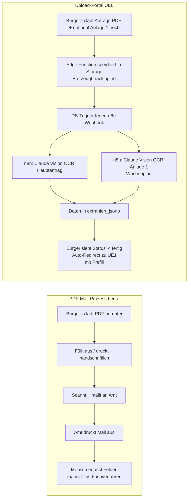

# 01 — Konzept: Vom Original-PDF zur OCR-getriebenen Übernahme

## Warum diese Stufe?

Selbst wenn ein Amt schon ein modernes Webformular wie UE1 anbietet — viele Bürgerinnen und Bürger füllen den Antrag trotzdem so aus, wie sie es schon immer gemacht haben: das offizielle PDF herunterladen, am Computer ausfüllen oder ausdrucken und handschriftlich eintragen, dann scannen und mailen. Heute landet so ein Eingang im Amt:

- als E-Mail-Anhang
- der dann von einer Person geöffnet, ausgedruckt, in die Akte geheftet wird
- und händisch ins Fachverfahren übertragen wird
- mit den klassischen Fehlerquellen: Zahlendreher, übersehene Felder, unleserliche Handschrift

UE0 ist die **Reifegradstufe 0**, die diesen Status quo aufhebt, ohne den Bürger zu zwingen, ein neues Webformular zu lernen: das Original-PDF bleibt die Quelle, aber statt es zu mailen, lädt er es über ein Portal hoch. Ein **KI-OCR-Pipeline (Claude Vision)** extrahiert alle Felder — auch handschriftlich Ausgefülltes — und übergibt sie an UE1, wo der Bürger die ausgelesenen Daten nur noch bestätigt oder korrigiert und absendet.

Die Stufe ist **„0", weil der Eingang noch das gewohnte PDF ist** — die digitale Verbesserung passiert unsichtbar im Hintergrund.

## Konzeptskizze

## Was technisch passiert

- **Frontend** (`ue0/upload-portal/`): Vanilla TypeScript + Vite, optisch an wuerzburg.de/formularcenter angelehnt
- **Zwei klar getrennte Upload-Boxen**: rot=Pflicht (Hauptantrag), grau=Optional (Anlage 1 Wochenplan); FormData mit beiden Files in einem POST
- **Edge Function** `upload-antragspdf` (Deno) auf Supabase: validiert MIME + Größe (≤ 10 MB), speichert in Storage-Bucket `antragseingang-pdf`, erzeugt Tracking-Eintrag in `apl2.antrag_einreichung`
- **DB-Trigger** `trg_notify_n8n_on_pdf_einreichung` sendet `pg_notify` → Listener feuert HTTP-POST an n8n-Webhook
- **n8n-Workflow** (11 Nodes) mit IF-Switch:
  1. Hauptantrag-Branch (immer): Storage → Base64 → Claude Vision (Schema-Prompt mit allen Hauptantrag-Feldern) → JSON parsen + Defaults
  2. Anlage-Branch (nur wenn `anlage_1_storage_path` gesetzt): Storage → Base64 → Claude Vision (Wochenplan-Prompt) → JSON parsen + in `extrahiert_jsonb.oeffnungszeiten` mergen
  3. Beide Branches → UPDATE `antrag_einreichung` mit `status='fertig'` + komplettem `extrahiert_jsonb`
- **Status-Polling** vom Browser (alle 3 s): wartet auf `status='fertig'`, dann **Auto-Redirect** auf UE1 mit `?prefill=<einreichung_id>` — der Bürger landet im UE1-Webformular mit vorausgefüllten Feldern und kann bestätigen oder editieren
- **Saubere Trennung**: OCR-Daten leben nur in `antrag_einreichung.extrahiert_jsonb`. Erst beim finalen Submit in UE1 wird der echte Datensatz in `apl2.antraege` angelegt — wenn der Bürger UE1 abbricht, bleibt kein Geister-Antrag in der Datenbank zurück.
