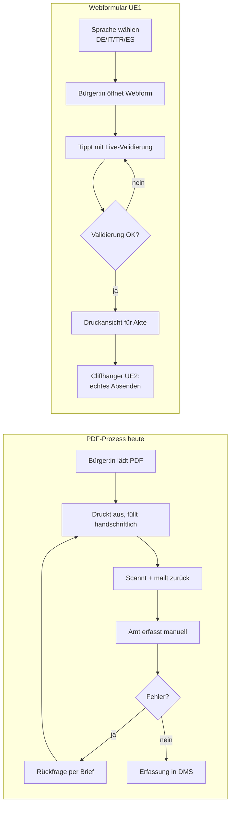

# 01 — Konzept: Vom PDF zum mehrsprachigen Webformular

## Warum diese Stufe?

Heute lädt eine Bürgerin oder ein Bürger das PDF-Antragsformular für den Altenhilfeplan APL 2 herunter, druckt es aus, füllt es per Hand aus, scannt es ein und mailt es an die Beratungsstelle für Senioren. Typische Probleme:

- Pflichtfelder werden übersehen
- IBAN mit Zahlendreher → Bank lehnt Auszahlung ab
- Anlagen werden vergessen → Rückfrage per Brief → Wochen Verzögerung
- Handschrift unleserlich → Erfassungsfehler im Amt
- **Sprachbarriere**: das deutsche PDF ist für nicht-deutschsprachige Antragsteller schwer zugänglich — gerade in einer Stadt wie Würzburg mit hohem Anteil italienischer, türkischer und spanischer Mitbürger

Ein **intelligentes, mehrsprachiges Webformular** als erste Reifegradstufe ändert das, was technisch ohne große organisatorische Vorbedingungen sofort umsetzbar ist: Eingaben werden im Browser validiert, Anlagen geprüft, Labels in 4 Sprachen wählbar.

## Konzeptskizze

## Was technisch passiert

- HTML-Formular mit Pflichtfeld-Markierung (HTML5 + ARIA)
- TypeScript-Funktionen für **Validierung pro Feld** (IBAN-Prüfziffer, E-Mail-Format, Datum)
- **Cross-Field-Regeln**: z.B. „Wenn keine eigenen Räume → Miete muss > 0 sein"
- **Anlagen-Vorprüfung**: PDF-Typ + max. 10 MB
- **i18n**: Labels über `data-i18n`-Attribute, Übersetzungs-Tabelle in DE/IT/TR/ES, Sprache persistiert in `localStorage`
- **Druck-Stylesheet** für die Papier-Akte (Zwischenstadium, das UE2 verdrängt)
- Submit erzeugt **clientseitige Antragsnummer** und zeigt Bestätigung — die Daten verlassen den Browser nicht
