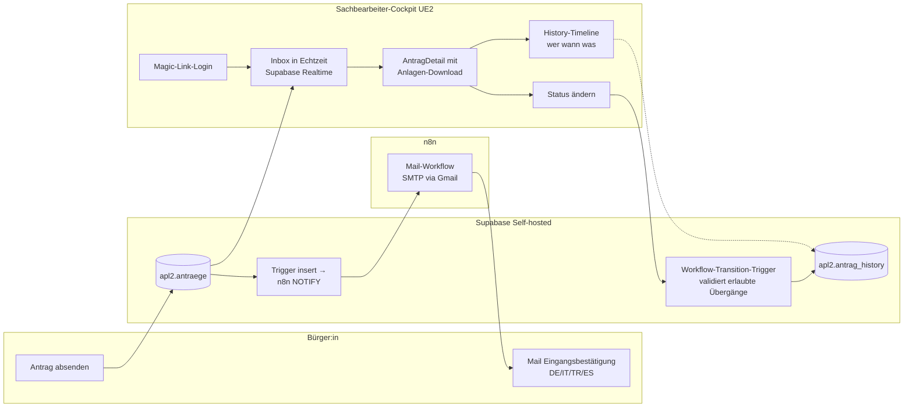

# 01 — Konzept: Vom Postausgang zum lebendigen Sachbearbeiter-Cockpit

## Warum diese Stufe?

UE1 hat den Antrag sauber in die Datenbank gebracht — aber damit ist erst die halbe Strecke geschafft. Im Amt passiert heute typischerweise das hier:

- Der Antrag liegt als PDF im Postfach oder gemeinsamen Mail-Account
- Mehrere Sachbearbeitende greifen drauf zu, niemand weiß genau, wer schon was bearbeitet
- Der Bürger bekommt keine Eingangsbestätigung — er weiß nicht, ob seine Mail überhaupt angekommen ist
- Statusänderungen werden in Excel-Listen oder am Papier-Akten-Deckel notiert
- Wenn der Bürger anruft: „Da müsste ich mal nachschauen, kann ich Sie zurückrufen?"

UE2 hebt das auf eine erste echte Verwaltungs-IT-Stufe: **eine geteilte Inbox mit Workflow-Engine und Audit-Trail.** Das Frontend ist eine React-App, die Magic-Link-authentifiziert in Echtzeit alle Anträge zeigt, die das Amt erreicht haben. Der Bürger bekommt automatisch eine 4-sprachige Eingangsbestätigung per Mail.

## Konzeptskizze

## Was technisch passiert

- **React 19 + Vite 6 + Tailwind 4 + TypeScript 5** als Frontend
- **Supabase Magic-Link** als Auth — kein eigener Login-Server, eine Allowlist `apl2.allow_email` entscheidet, wer reinkommt (Defense-in-Depth über RLS auf allen Tabellen)
- **Supabase Realtime** für die Inbox: jede Status- oder Insert-Änderung erscheint sofort bei allen eingeloggten Sachbearbeitenden
- **Workflow als Datenmodell**: erlaubte Status-Übergänge stehen in `apl2.workflow_transition` (eingegangen → in_pruefung → {rueckfrage, bewilligt, abgelehnt}). Ein Postgres-Trigger validiert serverseitig, dass das Frontend nicht versehentlich verbotene Übergänge schickt (Defense-in-Depth).
- **Audit-Trail** in `apl2.antrag_history`: automatischer Trigger schreibt bei jeder Statusänderung einen Eintrag mit `actor`, `vorher`, `nachher`, `kommentar`. Im Frontend als Timeline angezeigt — vollständig revisionssicher.
- **Eingangsbestätigung** via n8n: ein Workflow `n8n-apl2-eingangsbestaetigung.json` lauscht auf neue Inserts in `apl2.antraege`, baut die Mail in der `submitted_language` des Bürgers (Switch-Expression mit 4 Sprachen) und sendet sie über SMTP.
- **Anlagen-Download** mit signierten URLs aus dem private Storage-Bucket — Sachbearbeitende mit Login dürfen runterladen, anonyme Dritte nicht.
- **Eigene Subdomain** `amt.butscher.cloud` mit eigenem TLS-Zertifikat (Traefik / Let's Encrypt) — der Wegfall der GH-Pages-Hosting-Variante ist bewusst: Amts-Apps gehören nicht zu GitHub.
