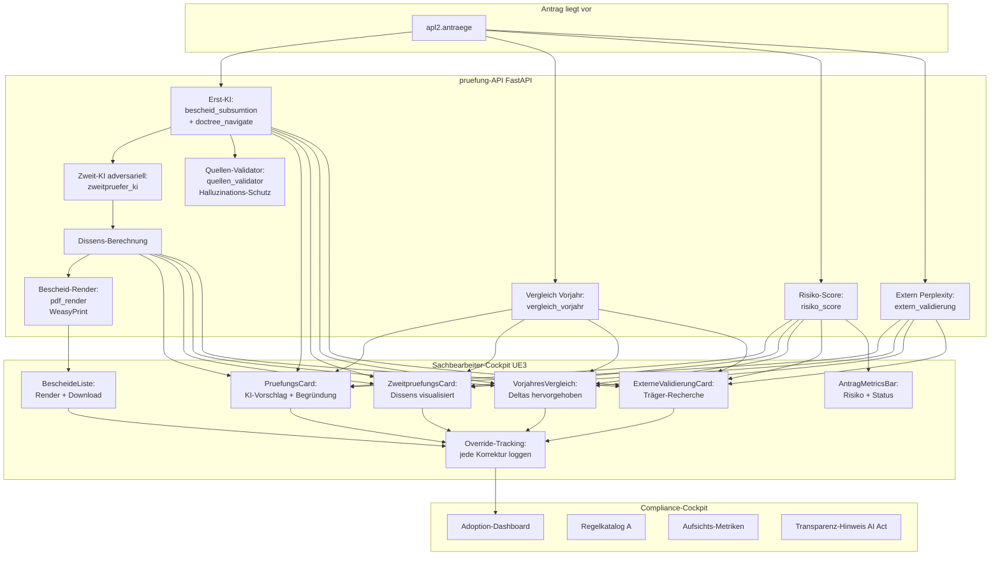

# 01 — Konzept: KI prüft, Mensch entscheidet

## Warum diese Stufe?

UE2 hat das Amt mit einer vernünftigen Inbox versorgt — aber die eigentliche Arbeit, die fachliche Prüfung des Antrags gegen die Förderrichtlinie, macht weiterhin ein Mensch komplett von Hand:

- Förderrichtlinie als PDF lesen (35 Seiten)
- Pro Antrag jeden Paragraphen durchgehen und prüfen, ob er einschlägig ist
- Vorjahresantrag aus dem Aktenkeller holen, vergleichen
- Träger googeln, prüfen ob es ihn überhaupt gibt und ob er als gemeinnützig anerkannt ist
- Bei Bewilligung: Bescheid in Word freitexten, juristisch konsistent argumentieren
- Bei Ablehnung: Begründung formulieren, die rechtssicher gegen Klage hält

Das ist die Stelle, an der die Reifegrade richtig spannend werden — denn hier kommt **die KI als kompetente Mitarbeiterin** ins Spiel, nicht als Spielzeug. UE3 baut **drei aufeinander aufbauende KI-Komponenten** rund um die Sachbearbeitung:

1. **Erst-Prüfung**: Ein LLM (Claude Sonnet 4.5) erhält den Antrag + die Förderrichtlinie als strukturierten Doctree und schlägt eine Entscheidung mit paragrapheneigener Begründung vor
2. **Zweit-Prüfung**: Ein zweites LLM (Claude Opus) bekommt einen Gegen-Prompt und sucht aktiv nach Gegenargumenten — das adversarielle 4-Augen-Prinzip auf KI-Ebene
3. **Externe Validierung** (optional): Perplexity-Recherche zum Träger (Existenz, Status, Gemeinnützigkeit)

Der Sachbearbeitende sieht **alle drei KI-Outputs nebeneinander**, kann jeden Vorschlag overrulen, jede Korrektur wird gespeichert (Adoption-Tracking). Die KI **entscheidet nicht** — sie schlägt vor und dokumentiert ihre Argumentation. Human-in-the-Loop ist nicht Lippenbekenntnis, sondern System-Architektur.

## Konzeptskizze

## Was technisch passiert

### Backend (`pruefung/` — FastAPI in Python)

- **`bescheid_subsumtion.py`** — Der Erst-Prüfer. Holt aus `apl2.norm_section` + `apl2.norm_statement` die strukturierte Förderrichtlinie (Doctree), navigiert mit `doctree_navigate` zu den relevanten Abschnitten, ruft Claude mit Antrag + Doctree-Auszug + JSON-Schema-Output-Definition auf. Ergebnis: Per-Paragraph-Bewertung mit `erfuellt | nicht_erfuellt | unklar` + Begründung mit Doctree-Refs.
- **`zweitpruefer_ki.py`** — Der adversarielle Zweit-Prüfer. Bekommt den Antrag UND das Erst-Ergebnis und einen Gegen-Prompt: „Finde Gründe, warum diese Erstprüfung falsch sein könnte." Ergebnis: dieselbe Struktur wie Erst-Prüfung.
- **`dissens.py`** — Vergleicht Erst- und Zweit-Ergebnis Paragraph für Paragraph, klassifiziert: `konsens | inhaltlich_unterschiedlich | gegensätzlich`. Das Frontend zeigt die Dissens-Cluster.
- **`vergleich_vorjahr.py`** — Sucht den Vorjahresantrag des gleichen Trägers, berechnet Deltas (Kosten ±%, Bemessungsgrößen, Räume). Ergebnis fließt in die Bescheid-Argumentation (anteilige Höchstauszahlung).
- **`risiko_score.py`** — Heuristik (kein LLM) auf Basis von Kostensprüngen, Vorjahresvergleich, Vollständigkeit der Felder. 0–100. Wird in der Inbox als Sortier-Spalte angezeigt.
- **`extern_validierung.py`** — Optional: Perplexity-Search-API ruft Träger-Status ab (Vereinsregister, Steuer-Status), zitiert Quellen. Wir prüfen aktiv, dass die Quellen-URLs erreichbar sind (kein „Hallu-Quellen-Risiko").
- **`quellen_validator.py`** — Beim Bescheid-Render: jeder zitierte Paragraph muss in `apl2.norm_statement` existieren. Halluzinierte Paragraphen werden vor dem Render gefiltert + geloggt.
- **`pdf_render.py`** — Jinja-Template + WeasyPrint, erzeugt Bescheid als PDF mit AI-Act-konformem Transparenz-Hinweis im Footer.
- **`adoption_metrics.py`** — Adoption-Tracking: jede Sachbearbeiter-Korrektur wird mit Original-KI-Vorschlag + Override in `apl2.ki_override` gespeichert. Compliance-Cockpit visualisiert die Quote.
- **`compliance.py`** — Liefert die Aufsichts-Metriken-Endpoints für das Compliance-Cockpit (Adoption-Quote, Bescheid-Renderzeit, Dissens-Häufigkeit, externe-Validierung-Trefferquote).
- **`llm_client.py`** — Provider-Abstraktion: Anthropic primary, **LM Studio** als lokal-self-hosted Alternative. Konfig per `LLM_PROVIDER`-Env. Cost-Tracking pro Aufruf.

### Frontend (`ue3/sachbearbeitung-ki/` — React 19)

- **Pages**: `Inbox` (mit Risiko-Spalte), `AntragDetail` (zentrale Sicht mit allen KI-Cards), `ComplianceStatus`, `AdoptionDashboard`, `AhpInspector`, `NormStatementsInspector`, `OntologieInspector`
- **Komponenten**: `PruefungsCard`, `ZweitpruefungsCard`, `VorjahresVergleich`, `ExterneValidierungCard`, `BescheideListe`, `AntragMetricsBar`, `HistoryTimeline`
- **Hooks**: `useAntrag`, `useAntraege`, `usePruefungen`, `useSession`, `useUserRole`
- **Workflow**: erweitert UE2 um Zweitprüfung-Status (`zweitpruefung_offen` / `zweitpruefung_in_arbeit` / `zweitpruefung_dissens`), blockt Bescheid-Erstellung bei offener Zweitprüfung

### Datenhaltung

- **Strukturierte Förderrichtlinie**: `apl2.norm_section` (Hierarchie) + `apl2.norm_statement` (atomare Aussagen mit Refs), gepflegt via `apl2.ahp_norm_statements`-Migrationen (049 ff.)
- **Prüfergebnisse**: `apl2.pruefungen` (eine Zeile pro Prüfdurchlauf — Erst, Zweit, je Antrag)
- **Bescheide**: `apl2.bescheide` (Render-Output + Hash + PDF-URL)
- **Override-Log**: `apl2.ki_override` (Adoption-Tracking)
- **Embeddings** (für Doctree-Navigation): `apl2.norm_statement_embeddings` (Voyage 3)
